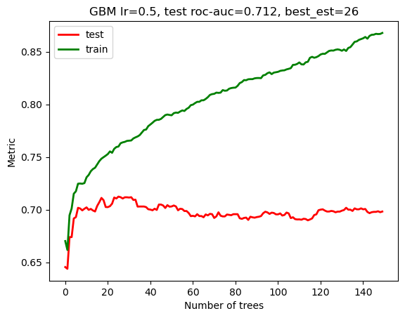
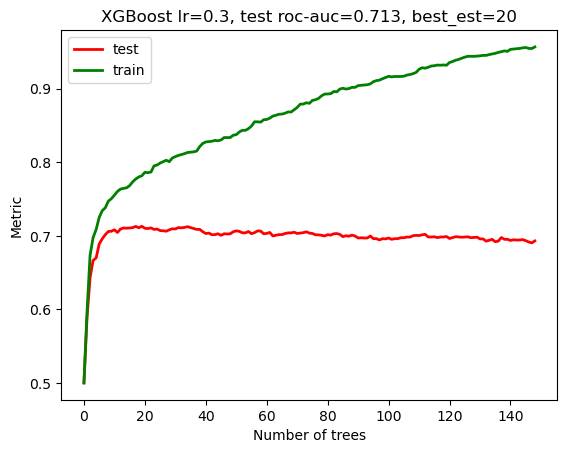
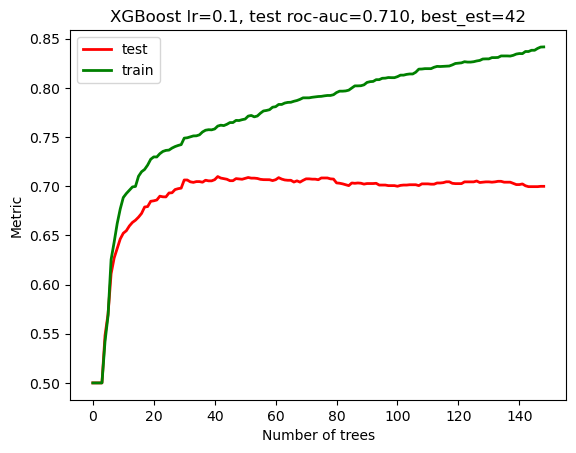

# Сравнение алгоритмов градиентного бустинга или история знает только первых...


Всем привет ! Данная статья написана по итогам обучения на курсе Otus ML Basic и в ней я проведу сравнение алгоритмов градиентного бустинга. Почему бустинг, спросите вы ? Понятно, что нейронные сети интереснее, но не всегда их применение целесообразно и есть задачи для которых классические методы машинного обучения являются лучшим выбором. Бустинг является одним из наиболее эффективных классических алгоритмов и поскольку существуют различные его реализации, то мы проведем сравнение, чтобы понять, кто из них демонстрирует лучшие результаты. Познакомимся с участниками турнира, чьи реализации алгоритма градиентного бустинга будут участвовать в сравнении: 

- Sklearn;
- XGBoost;
- LightGBM;
- Catboost;

Напомню, что бустинг реализует идею построения "сильной" модели на основе композиции базовых алгоритмов (как правило, деревьев решений), точность предсказания которых  может быть лишь немногим выше случайного угадывания. Общий подход к реализации выглядит следующим образом:

- строим алгоритмы последовательно;
- каждый следующий строится на ошибках предыдущего;
- решение принимается методом взвешенного голосования;

Проводить сравнение алгоритмов бустинга мы будем на [наборе данных](https://www.kaggle.com/datasets/blastchar/telco-customer-churn) для классификации, а именно, предсказания оттока клиентов телеком оператора. Полную версию jupyter ноутбука все желающие могут найти [здесь](https://github.com/DzenGarden/Otus-ML/blob/main/articles/ensemble-of-models/boosting-algorithms.ipynb).

<details>
<summary> Подключаем необходимые библиотеки </summary>


```python
import numpy as np 
import pandas as pd 
import seaborn as sns 
import matplotlib.pyplot as plt

from sklearn.model_selection import train_test_split
from sklearn.metrics import accuracy_score, precision_score, recall_score, f1_score, roc_auc_score
from sklearn.preprocessing import LabelEncoder, StandardScaler

from sklearn.ensemble import GradientBoostingClassifier
from xgboost import XGBClassifier
from lightgbm import LGBMClassifier
from catboost import CatBoostClassifier

from sklearn.model_selection import GridSearchCV

import warnings
warnings.filterwarnings("ignore")
```

</details>

Загрузим датасет 


```python
df = pd.read_csv('data/WA_Fn-UseC_-Telco-Customer-Churn.csv', index_col=0)
```


```python
df.head()
```


<div>
<style scoped>
    .dataframe tbody tr th:only-of-type {
        vertical-align: middle;
    }

    .dataframe tbody tr th {
        vertical-align: top;
    }

    .dataframe thead th {
        text-align: right;
    }
</style>
<table border="1" class="dataframe">
  <thead>
    <tr style="text-align: right;">
      <th></th>
      <th>gender</th>
      <th>SeniorCitizen</th>
      <th>Partner</th>
      <th>Dependents</th>
      <th>tenure</th>
      <th>PhoneService</th>
      <th>MultipleLines</th>
      <th>InternetService</th>
      <th>OnlineSecurity</th>
      <th>OnlineBackup</th>
      <th>DeviceProtection</th>
      <th>TechSupport</th>
      <th>StreamingTV</th>
      <th>StreamingMovies</th>
      <th>Contract</th>
      <th>PaperlessBilling</th>
      <th>PaymentMethod</th>
      <th>MonthlyCharges</th>
      <th>TotalCharges</th>
      <th>Churn</th>
    </tr>
    <tr>
      <th>customerID</th>
      <th></th>
      <th></th>
      <th></th>
      <th></th>
      <th></th>
      <th></th>
      <th></th>
      <th></th>
      <th></th>
      <th></th>
      <th></th>
      <th></th>
      <th></th>
      <th></th>
      <th></th>
      <th></th>
      <th></th>
      <th></th>
      <th></th>
      <th></th>
    </tr>
  </thead>
  <tbody>
    <tr>
      <th>7590-VHVEG</th>
      <td>Female</td>
      <td>0</td>
      <td>Yes</td>
      <td>No</td>
      <td>1</td>
      <td>No</td>
      <td>No phone service</td>
      <td>DSL</td>
      <td>No</td>
      <td>Yes</td>
      <td>No</td>
      <td>No</td>
      <td>No</td>
      <td>No</td>
      <td>Month-to-month</td>
      <td>Yes</td>
      <td>Electronic check</td>
      <td>29.85</td>
      <td>29.85</td>
      <td>No</td>
    </tr>
    <tr>
      <th>5575-GNVDE</th>
      <td>Male</td>
      <td>0</td>
      <td>No</td>
      <td>No</td>
      <td>34</td>
      <td>Yes</td>
      <td>No</td>
      <td>DSL</td>
      <td>Yes</td>
      <td>No</td>
      <td>Yes</td>
      <td>No</td>
      <td>No</td>
      <td>No</td>
      <td>One year</td>
      <td>No</td>
      <td>Mailed check</td>
      <td>56.95</td>
      <td>1889.5</td>
      <td>No</td>
    </tr>
    <tr>
      <th>3668-QPYBK</th>
      <td>Male</td>
      <td>0</td>
      <td>No</td>
      <td>No</td>
      <td>2</td>
      <td>Yes</td>
      <td>No</td>
      <td>DSL</td>
      <td>Yes</td>
      <td>Yes</td>
      <td>No</td>
      <td>No</td>
      <td>No</td>
      <td>No</td>
      <td>Month-to-month</td>
      <td>Yes</td>
      <td>Mailed check</td>
      <td>53.85</td>
      <td>108.15</td>
      <td>Yes</td>
    </tr>
    <tr>
      <th>7795-CFOCW</th>
      <td>Male</td>
      <td>0</td>
      <td>No</td>
      <td>No</td>
      <td>45</td>
      <td>No</td>
      <td>No phone service</td>
      <td>DSL</td>
      <td>Yes</td>
      <td>No</td>
      <td>Yes</td>
      <td>Yes</td>
      <td>No</td>
      <td>No</td>
      <td>One year</td>
      <td>No</td>
      <td>Bank transfer (automatic)</td>
      <td>42.30</td>
      <td>1840.75</td>
      <td>No</td>
    </tr>
    <tr>
      <th>9237-HQITU</th>
      <td>Female</td>
      <td>0</td>
      <td>No</td>
      <td>No</td>
      <td>2</td>
      <td>Yes</td>
      <td>No</td>
      <td>Fiber optic</td>
      <td>No</td>
      <td>No</td>
      <td>No</td>
      <td>No</td>
      <td>No</td>
      <td>No</td>
      <td>Month-to-month</td>
      <td>Yes</td>
      <td>Electronic check</td>
      <td>70.70</td>
      <td>151.65</td>
      <td>Yes</td>
    </tr>
  </tbody>
</table>
</div>


Посмотрим на основные параметры набора данных


```python
df.info()
```

    <class 'pandas.core.frame.DataFrame'>
    Index: 7043 entries, 7590-VHVEG to 3186-AJIEK
    Data columns (total 20 columns):
     #   Column            Non-Null Count  Dtype  
    ---  ------            --------------  -----  
     0   gender            7043 non-null   object 
     1   SeniorCitizen     7043 non-null   int64  
     2   Partner           7043 non-null   object 
     3   Dependents        7043 non-null   object 
     4   tenure            7043 non-null   int64  
     5   PhoneService      7043 non-null   object 
     6   MultipleLines     7043 non-null   object 
     7   InternetService   7043 non-null   object 
     8   OnlineSecurity    7043 non-null   object 
     9   OnlineBackup      7043 non-null   object 
     10  DeviceProtection  7043 non-null   object 
     11  TechSupport       7043 non-null   object 
     12  StreamingTV       7043 non-null   object 
     13  StreamingMovies   7043 non-null   object 
     14  Contract          7043 non-null   object 
     15  PaperlessBilling  7043 non-null   object 
     16  PaymentMethod     7043 non-null   object 
     17  MonthlyCharges    7043 non-null   float64
     18  TotalCharges      7043 non-null   object 
     19  Churn             7043 non-null   object 
    dtypes: float64(1), int64(2), object(17)
    memory usage: 1.1+ MB


В наборе данных всего лишь 3 признака из 20 имеют числовой тип, поэтому, первое что необходимо сделать, это преобразовать категориальные признаки в числовые, а также провести другую предобработку данных, при необходимости.

## Предварительная обработка данных 

Проведем предварительную обработку набора данных и для начала проверим, есть ли в данных пропущенные значения


```python
df.isna().sum()
```


    gender              0
    SeniorCitizen       0
    Partner             0
    Dependents          0
    tenure              0
    PhoneService        0
    MultipleLines       0
    InternetService     0
    OnlineSecurity      0
    OnlineBackup        0
    DeviceProtection    0
    TechSupport         0
    StreamingTV         0
    StreamingMovies     0
    Contract            0
    PaperlessBilling    0
    PaymentMethod       0
    MonthlyCharges      0
    TotalCharges        0
    Churn               0
    dtype: int64


Пропусков в данных нет и это хорошо, но есть 17 категориальных признаков, которые необходимо привести к числовому виду:


```python
df.select_dtypes(include='object').columns
```


    Index(['gender', 'Partner', 'Dependents', 'PhoneService', 'MultipleLines',
           'InternetService', 'OnlineSecurity', 'OnlineBackup', 'DeviceProtection',
           'TechSupport', 'StreamingTV', 'StreamingMovies', 'Contract',
           'PaperlessBilling', 'PaymentMethod', 'TotalCharges', 'Churn'],
          dtype='object')


Посмотрим на количество уникальных значений для каждого из атрибутов


```python
df.nunique()
```


    gender                 2
    SeniorCitizen          2
    Partner                2
    Dependents             2
    tenure                73
    PhoneService           2
    MultipleLines          3
    InternetService        3
    OnlineSecurity         3
    OnlineBackup           3
    DeviceProtection       3
    TechSupport            3
    StreamingTV            3
    StreamingMovies        3
    Contract               3
    PaperlessBilling       2
    PaymentMethod          4
    MonthlyCharges      1585
    TotalCharges        6531
    Churn                  2
    dtype: int64


Начнем с замены бинарных категориальных признаков значениями 1/0

<details>
<summary> Код преобразования бинарных признаков </summary>


```python
bin_cat_cols_list = []
for index, value in df.nunique().items():
    if value == 2:
        bin_cat_cols_list.append(index)
        print(f"Index : {index}, Value : {value}")
```

```python
    Index : gender, Value : 2
    Index : SeniorCitizen, Value : 2
    Index : Partner, Value : 2
    Index : Dependents, Value : 2
    Index : PhoneService, Value : 2
    Index : PaperlessBilling, Value : 2
    Index : Churn, Value : 2
```


```python
bin_cat_cols_list
```


```python
    ['gender',
     'SeniorCitizen',
     'Partner',
     'Dependents',
     'PhoneService',
     'PaperlessBilling',
     'Churn']
```


```python
for col in bin_cat_cols_list:
    print(col, df[col].unique())
```

```python
    gender ['Female' 'Male']
    SeniorCitizen [0 1]
    Partner ['Yes' 'No']
    Dependents ['No' 'Yes']
    PhoneService ['No' 'Yes']
    PaperlessBilling ['Yes' 'No']
    Churn ['No' 'Yes']
```

атрибут SeniorCitizen уже имеет значения 0/1, поэтому исключим его из дальнейшей обработки


```python
bin_cat_cols_list.remove('SeniorCitizen')
```


```python
for col in bin_cat_cols_list:
    print(col, df[col].unique())
```

```python
    gender ['Female' 'Male']
    Partner ['Yes' 'No']
    Dependents ['No' 'Yes']
    PhoneService ['No' 'Yes']
    PaperlessBilling ['Yes' 'No']
    Churn ['No' 'Yes']
```

Итого, у нас 6 бинарных категориальных признаков - заменим их значениями 0/1


```python
g_dict = {'Female':0, 'Male':1}
```


```python
df['gender'] = df['gender'].map(g_dict)
```


```python
yn_dict = {'Yes':1, 'No':0}
```


```python
for col in bin_cat_cols_list[1:]:
    df[col] = df[col].map(yn_dict)
```

</details>

Посмотрим, что у нас получилось по итогам преобразования бинарных атрибутов 


```python
df.info()
```

    <class 'pandas.core.frame.DataFrame'>
    Index: 7043 entries, 7590-VHVEG to 3186-AJIEK
    Data columns (total 20 columns):
     #   Column            Non-Null Count  Dtype  
    ---  ------            --------------  -----  
     0   gender            7043 non-null   int64  
     1   SeniorCitizen     7043 non-null   int64  
     2   Partner           7043 non-null   int64  
     3   Dependents        7043 non-null   int64  
     4   tenure            7043 non-null   int64  
     5   PhoneService      7043 non-null   int64  
     6   MultipleLines     7043 non-null   object 
     7   InternetService   7043 non-null   object 
     8   OnlineSecurity    7043 non-null   object 
     9   OnlineBackup      7043 non-null   object 
     10  DeviceProtection  7043 non-null   object 
     11  TechSupport       7043 non-null   object 
     12  StreamingTV       7043 non-null   object 
     13  StreamingMovies   7043 non-null   object 
     14  Contract          7043 non-null   object 
     15  PaperlessBilling  7043 non-null   int64  
     16  PaymentMethod     7043 non-null   object 
     17  MonthlyCharges    7043 non-null   float64
     18  TotalCharges      7043 non-null   object 
     19  Churn             7043 non-null   int64  
    dtypes: float64(1), int64(8), object(11)
    memory usage: 1.1+ MB


Поработаем с оставшимися 11 категориальными признаками и начнем с приведения TotalCharges к типу float


```python
df['TotalCharges'] = pd.to_numeric(df['TotalCharges'], errors='coerce')
```


```python
df.isna().sum()
```


```python
    gender               0
    SeniorCitizen        0
    Partner              0
    Dependents           0
    tenure               0
    PhoneService         0
    MultipleLines        0
    InternetService      0
    OnlineSecurity       0
    OnlineBackup         0
    DeviceProtection     0
    TechSupport          0
    StreamingTV          0
    StreamingMovies      0
    Contract             0
    PaperlessBilling     0
    PaymentMethod        0
    MonthlyCharges       0
    TotalCharges        11
    Churn                0
    dtype: int64
```


Видим, что есть 11 пропущенных значений в Total Charges, записей немного, поэтому, просто удалим их из набора данных


```python
df.dropna(inplace = True)
```


```python
df.info()
```

    <class 'pandas.core.frame.DataFrame'>
    Index: 7032 entries, 7590-VHVEG to 3186-AJIEK
    Data columns (total 20 columns):
     #   Column            Non-Null Count  Dtype  
    ---  ------            --------------  -----  
     0   gender            7032 non-null   int64  
     1   SeniorCitizen     7032 non-null   int64  
     2   Partner           7032 non-null   int64  
     3   Dependents        7032 non-null   int64  
     4   tenure            7032 non-null   int64  
     5   PhoneService      7032 non-null   int64  
     6   MultipleLines     7032 non-null   object 
     7   InternetService   7032 non-null   object 
     8   OnlineSecurity    7032 non-null   object 
     9   OnlineBackup      7032 non-null   object 
     10  DeviceProtection  7032 non-null   object 
     11  TechSupport       7032 non-null   object 
     12  StreamingTV       7032 non-null   object 
     13  StreamingMovies   7032 non-null   object 
     14  Contract          7032 non-null   object 
     15  PaperlessBilling  7032 non-null   int64  
     16  PaymentMethod     7032 non-null   object 
     17  MonthlyCharges    7032 non-null   float64
     18  TotalCharges      7032 non-null   float64
     19  Churn             7032 non-null   int64  
    dtypes: float64(2), int64(8), object(10)
    memory usage: 1.1+ MB


Оставшиеся категориальные признаки преобразуем с использованием LabelEncoder пакета sklearn

<details>
<summary> Код преобразования признаков </summary>


```python
obj_cols = df.select_dtypes(include='object').columns
```


```python
obj_cols
```


```python
    Index(['MultipleLines', 'InternetService', 'OnlineSecurity', 'OnlineBackup',
           'DeviceProtection', 'TechSupport', 'StreamingTV', 'StreamingMovies',
           'Contract', 'PaymentMethod'],
          dtype='object')
```


```python
for col in obj_cols:
    print(col, df[col].unique())
```


```python
    MultipleLines ['No phone service' 'No' 'Yes']
    InternetService ['DSL' 'Fiber optic' 'No']
    OnlineSecurity ['No' 'Yes' 'No internet service']
    OnlineBackup ['Yes' 'No' 'No internet service']
    DeviceProtection ['No' 'Yes' 'No internet service']
    TechSupport ['No' 'Yes' 'No internet service']
    StreamingTV ['No' 'Yes' 'No internet service']
    StreamingMovies ['No' 'Yes' 'No internet service']
    Contract ['Month-to-month' 'One year' 'Two year']
    PaymentMethod ['Electronic check' 'Mailed check' 'Bank transfer (automatic)'
     'Credit card (automatic)']
```


```python
label_encoder = LabelEncoder()
```


```python
for col in obj_cols:
    df[col] = label_encoder.fit_transform(df[col])
```


```python
for col in obj_cols:
    print(col, df[col].unique())
```


```python
    MultipleLines [1 0 2]
    InternetService [0 1 2]
    OnlineSecurity [0 2 1]
    OnlineBackup [2 0 1]
    DeviceProtection [0 2 1]
    TechSupport [0 2 1]
    StreamingTV [0 2 1]
    StreamingMovies [0 2 1]
    Contract [0 1 2]
    PaymentMethod [2 3 0 1]
```


</details>

Проверим, что у нас получилось после всех преобразований:


```python
df.info()
```

    <class 'pandas.core.frame.DataFrame'>
    Index: 7032 entries, 7590-VHVEG to 3186-AJIEK
    Data columns (total 20 columns):
     #   Column            Non-Null Count  Dtype  
    ---  ------            --------------  -----  
     0   gender            7032 non-null   int64  
     1   SeniorCitizen     7032 non-null   int64  
     2   Partner           7032 non-null   int64  
     3   Dependents        7032 non-null   int64  
     4   tenure            7032 non-null   int64  
     5   PhoneService      7032 non-null   int64  
     6   MultipleLines     7032 non-null   int64  
     7   InternetService   7032 non-null   int64  
     8   OnlineSecurity    7032 non-null   int64  
     9   OnlineBackup      7032 non-null   int64  
     10  DeviceProtection  7032 non-null   int64  
     11  TechSupport       7032 non-null   int64  
     12  StreamingTV       7032 non-null   int64  
     13  StreamingMovies   7032 non-null   int64  
     14  Contract          7032 non-null   int64  
     15  PaperlessBilling  7032 non-null   int64  
     16  PaymentMethod     7032 non-null   int64  
     17  MonthlyCharges    7032 non-null   float64
     18  TotalCharges      7032 non-null   float64
     19  Churn             7032 non-null   int64  
    dtypes: float64(2), int64(18)
    memory usage: 1.4+ MB


Видим, что все признаки теперь числовые и наш датасет готов к дальнейшей работе. Но прежде чем погрузиться в создание моделей градиентного бустинга, проведем разведочный анализ данных, aka Exploratory Data Analysis, он же EDA 

## EDA

Посмотрим на корреляцию в данных


```python
fig, ax = plt.subplots(figsize=(12, 6))
sns.heatmap(df.corr(), annot=True, linewidths=.5, fmt= '.1f',ax=ax);
```


    

    


Выберем признаки, корреляция Пирсона для которых превышает 0.6


```python
stacked = df.corr().stack()
```


```python
stacked[((stacked > 0.6) | (stacked < -0.6)) & (stacked != 1)]
```


    tenure          Contract          0.676734
                    TotalCharges      0.825880
    Contract        tenure            0.676734
    MonthlyCharges  TotalCharges      0.651065
    TotalCharges    tenure            0.825880
                    MonthlyCharges    0.651065
    dtype: float64


Визуализируем парные зависимости выбранных признаков


```python
sns.pairplot(data=df[['tenure','Contract','MonthlyCharges','TotalCharges','Churn']], hue='Churn')
plt.show;
```


    

    


Зависимость есть, но нелинейная, поэтому, не будем удалять атрибуты из набора данных.

### Корреляция целевой переменной с другими признаками:

Посмотрим на корреляцию оттока (Churn) с другими признаками 


```python
plt.figure(figsize=(8,6))
df.corr()['Churn'].sort_values(ascending = False).plot(kind='bar')
```


    

    


### Числовые признаки и целевая переменная

Посмотрим на распределение некоторых числовых признаков в разрезе целевой переменной

<details>
<summary> Код построения диаграмм </summary>


```python
fig = plt.subplots(nrows = 1,ncols = 3,figsize = (20,7))

plt.subplot(1,3,1)
ax = sns.kdeplot(df.MonthlyCharges[(df["Churn"] == 0)], color='#008080', fill= True, alpha=.7, linewidth=0)
ax = sns.kdeplot(df.MonthlyCharges[(df["Churn"] == 1)], color='#FF6347', fill= True, alpha=.7, linewidth=0)
ax.legend(["Not Churn","Churn"],loc='upper right')
ax.set_ylabel('Density')
ax.set_xlabel('Monthly Charges')
ax.set_title('Distribution of Monthly Charges by Churn')

plt.subplot(1,3,2)
ax = sns.kdeplot(df.TotalCharges[(df["Churn"] == 0)], color='#008080', fill= True, alpha=.7, linewidth=0)
ax = sns.kdeplot(df.TotalCharges[(df["Churn"] == 1)], color='#FF6347', fill= True, alpha=.7, linewidth=0)
ax.legend(["Not Churn","Churn"],loc='upper right')
ax.set_ylabel('Density')
ax.set_xlabel('Total Charges')
ax.set_title('Distribution of Total Charges by Churn')

plt.subplot(1,3,3)
ax = sns.kdeplot(df.tenure[(df["Churn"] == 0)], color='#008080', fill= True, alpha=.7, linewidth=0)
ax = sns.kdeplot(df.tenure[(df["Churn"] == 1)], color='#FF6347', fill= True, alpha=.7, linewidth=0)
ax.legend(["Not Churn","Churn"],loc='upper right')
ax.set_ylabel('Density')
ax.set_xlabel('Tenure')
ax.set_title('Distribution of Tenure by Churn')

plt.show()
```
</details>

    

    


Полученные диаграммы позволяют сделать несколько выводов:

- Диаграмма распределения ежемесячных платежей (Monthly Charges) показывает, что к оттоку склонны клиенты с большими суммами платежей, возможно, неожиданные счета за роуминг влияют на лояльность клиентов;
- Среди клиентов с большой общей суммой счетов (Total Charges) выше доля лояльных клиентов;
- Распределение по времени контракта (Tenure) демонстрирует лучшее разделение по целевой переменной - лояльные клиенты имеют давние контракты, в то время как новые клиенты наиболее склонны к оттоку;


И также посмотрим на распределение целевой переменной:

<details>
<summary> Код построения диаграмм </summary>


```python
#Defining colors for the plots
palette = ['#008080','#FF6347', '#E50000', '#D2691E']
```


```python
l1 = list(df['Churn'].value_counts())
pie_values = [l1[0] / sum(l1) * 100, l1[1] / sum(l1) * 100]

fig = plt.subplots(nrows = 1,ncols = 2,figsize = (20,7))

plt.subplot(1,2,1)
plt.pie(pie_values,labels = ['Not-Churn Customers','Churn Customers'], 
        autopct = '%1.2f%%',
        explode = (0.1,0),
        colors = palette,
        wedgeprops = {'edgecolor': 'black','linewidth': 1, 'antialiased' : True})
plt.title('Churn and Not-Churn Customers %');

plt.subplot(1,2,2)
ax = sns.countplot(data = df, 
                   x='Churn',
                   palette = palette, 
                   edgecolor = 'black')
for i in ax.containers:
    ax.bar_label(i,)
ax.set_xticklabels(['Not-Churn Customers','Churn Customers'])
    
plt.title('Churn and Not-Churn Customers')
plt.show()
```

</details>

    

    


Доля склонных к оттоку клиентов более четверти абонентской базы - угрожающее значение для бизнеса любого оператора связи, надеюсь, данной компании удалось как-то с этим справиться... Ну а мы переходим к заключительной части предварительной обработки данных.

## Разделение и масштабирование 

### Разделение набора данных на обучающую и тестовую выборки 

Как обычно, перед обучением модели, нам необходимо разделить датасет на обучающую (train) и тестовую (test) выборки. Используем для этого функцию train_test_split пакета sklearn и не забудем про параметр stratify, учитывая несбалансированность набора данных:


```python
X = df.drop('Churn', axis=1)
y = df['Churn']
```


```python
X_train, X_test, y_train, y_test = train_test_split(X, y, stratify=y, test_size = 0.3, random_state = 13)
```


### Масштабирование признаков 

Масштабирование числовых признаков набора данных является общим требованием для многих моделей машинного обучения и мы воспользуемся функцией StandardScaler модуля preprocessing пакета sklearn. StandardScaler центрирует значения признаков относительно нуля, вычитая среднее значение каждого признака, а затем масштабирует их, деля на стандартное отклонение:

$$ z = \frac{(x - \mu)}{\sigma} $$

где $\mu$ это среднее значение для признака из обучающего набора, $\sigma$  - стандартное отклонение


```python
numeric_columns = ['tenure', 'MonthlyCharges', 'TotalCharges']
std_scaler = StandardScaler()
X_train[numeric_columns] = std_scaler.fit_transform(X_train[numeric_columns])
X_test[numeric_columns]= std_scaler.transform(X_test[numeric_columns])
```


Теперь мы готовы строить наши модели.

## Sklearn

Открывать турнир будет реализация градиентного бустинга от sklearn и для удобства определим функцию, возвращающую значения метрик, по которым мы будем оценивать и сравнивать модели. Поскольку у нас задача бинарной классификации, то будем использовать соответствующие метрики, в частности - accuracy, precision, recall, f1-score и ROC-AUC. Сравнивать, так уж сравнивать )


```python
def quality(true_y, prediction_y):
    """
    Evaluates and returns the following metrics: Accuracy, Precision, Recall, F1-score, AUC
    """
    accuracy = round(accuracy_score(true_y, prediction_y), 3)
    precision = round(precision_score(true_y, prediction_y), 3)
    recall = round(recall_score(true_y, prediction_y), 3)
    f1 = round(f1_score(true_y, prediction_y), 3)
    auc = round(roc_auc_score(true_y, prediction_y), 3)
    print(f" Accuracy: {accuracy}")
    print(f"Precision: {precision}")
    print(f"   Recall: {recall}")
    print(f" F1-score: {f1}")
    print(f"      AUC: {auc}")
    return [accuracy, precision, recall, f1, auc]
```

Измеренные значения метрик будем складывать в словарь


```python
results = {}
```

В качестве точки отсчета запустим классификатор без настройки, со значениями гиперпараметров по умолчанию

<details>
<summary> Код запуска классификатора sklearn </summary>


```python
# first run with default parameters
sgb_clf = GradientBoostingClassifier(random_state=13)
```


```python
sgb_clf.fit(X_train, y_train)
```


<style>#sk-container-id-1 {
  /* Definition of color scheme common for light and dark mode */
  --sklearn-color-text: black;
  --sklearn-color-line: gray;
  /* Definition of color scheme for unfitted estimators */
  --sklearn-color-unfitted-level-0: #fff5e6;
  --sklearn-color-unfitted-level-1: #f6e4d2;
  --sklearn-color-unfitted-level-2: #ffe0b3;
  --sklearn-color-unfitted-level-3: chocolate;
  /* Definition of color scheme for fitted estimators */
  --sklearn-color-fitted-level-0: #f0f8ff;
  --sklearn-color-fitted-level-1: #d4ebff;
  --sklearn-color-fitted-level-2: #b3dbfd;
  --sklearn-color-fitted-level-3: cornflowerblue;

  /* Specific color for light theme */
  --sklearn-color-text-on-default-background: var(--sg-text-color, var(--theme-code-foreground, var(--jp-content-font-color1, black)));
  --sklearn-color-background: var(--sg-background-color, var(--theme-background, var(--jp-layout-color0, white)));
  --sklearn-color-border-box: var(--sg-text-color, var(--theme-code-foreground, var(--jp-content-font-color1, black)));
  --sklearn-color-icon: #696969;

  @media (prefers-color-scheme: dark) {
    /* Redefinition of color scheme for dark theme */
    --sklearn-color-text-on-default-background: var(--sg-text-color, var(--theme-code-foreground, var(--jp-content-font-color1, white)));
    --sklearn-color-background: var(--sg-background-color, var(--theme-background, var(--jp-layout-color0, #111)));
    --sklearn-color-border-box: var(--sg-text-color, var(--theme-code-foreground, var(--jp-content-font-color1, white)));
    --sklearn-color-icon: #878787;
  }
}

#sk-container-id-1 {
  color: var(--sklearn-color-text);
}

#sk-container-id-1 pre {
  padding: 0;
}

#sk-container-id-1 input.sk-hidden--visually {
  border: 0;
  clip: rect(1px 1px 1px 1px);
  clip: rect(1px, 1px, 1px, 1px);
  height: 1px;
  margin: -1px;
  overflow: hidden;
  padding: 0;
  position: absolute;
  width: 1px;
}

#sk-container-id-1 div.sk-dashed-wrapped {
  border: 1px dashed var(--sklearn-color-line);
  margin: 0 0.4em 0.5em 0.4em;
  box-sizing: border-box;
  padding-bottom: 0.4em;
  background-color: var(--sklearn-color-background);
}

#sk-container-id-1 div.sk-container {
  /* jupyter's `normalize.less` sets `[hidden] { display: none; }`
     but bootstrap.min.css set `[hidden] { display: none !important; }`
     so we also need the `!important` here to be able to override the
     default hidden behavior on the sphinx rendered scikit-learn.org.
     See: https://github.com/scikit-learn/scikit-learn/issues/21755 */
  display: inline-block !important;
  position: relative;
}

#sk-container-id-1 div.sk-text-repr-fallback {
  display: none;
}

div.sk-parallel-item,
div.sk-serial,
div.sk-item {
  /* draw centered vertical line to link estimators */
  background-image: linear-gradient(var(--sklearn-color-text-on-default-background), var(--sklearn-color-text-on-default-background));
  background-size: 2px 100%;
  background-repeat: no-repeat;
  background-position: center center;
}

/* Parallel-specific style estimator block */

#sk-container-id-1 div.sk-parallel-item::after {
  content: "";
  width: 100%;
  border-bottom: 2px solid var(--sklearn-color-text-on-default-background);
  flex-grow: 1;
}

#sk-container-id-1 div.sk-parallel {
  display: flex;
  align-items: stretch;
  justify-content: center;
  background-color: var(--sklearn-color-background);
  position: relative;
}

#sk-container-id-1 div.sk-parallel-item {
  display: flex;
  flex-direction: column;
}

#sk-container-id-1 div.sk-parallel-item:first-child::after {
  align-self: flex-end;
  width: 50%;
}

#sk-container-id-1 div.sk-parallel-item:last-child::after {
  align-self: flex-start;
  width: 50%;
}

#sk-container-id-1 div.sk-parallel-item:only-child::after {
  width: 0;
}

/* Serial-specific style estimator block */

#sk-container-id-1 div.sk-serial {
  display: flex;
  flex-direction: column;
  align-items: center;
  background-color: var(--sklearn-color-background);
  padding-right: 1em;
  padding-left: 1em;
}


/* Toggleable style: style used for estimator/Pipeline/ColumnTransformer box that is
clickable and can be expanded/collapsed.
- Pipeline and ColumnTransformer use this feature and define the default style
- Estimators will overwrite some part of the style using the `sk-estimator` class
*/

/* Pipeline and ColumnTransformer style (default) */

#sk-container-id-1 div.sk-toggleable {
  /* Default theme specific background. It is overwritten whether we have a
  specific estimator or a Pipeline/ColumnTransformer */
  background-color: var(--sklearn-color-background);
}

/* Toggleable label */
#sk-container-id-1 label.sk-toggleable__label {
  cursor: pointer;
  display: block;
  width: 100%;
  margin-bottom: 0;
  padding: 0.5em;
  box-sizing: border-box;
  text-align: center;
}

#sk-container-id-1 label.sk-toggleable__label-arrow:before {
  /* Arrow on the left of the label */
  content: "▸";
  float: left;
  margin-right: 0.25em;
  color: var(--sklearn-color-icon);
}

#sk-container-id-1 label.sk-toggleable__label-arrow:hover:before {
  color: var(--sklearn-color-text);
}

/* Toggleable content - dropdown */

#sk-container-id-1 div.sk-toggleable__content {
  max-height: 0;
  max-width: 0;
  overflow: hidden;
  text-align: left;
  /* unfitted */
  background-color: var(--sklearn-color-unfitted-level-0);
}

#sk-container-id-1 div.sk-toggleable__content.fitted {
  /* fitted */
  background-color: var(--sklearn-color-fitted-level-0);
}

#sk-container-id-1 div.sk-toggleable__content pre {
  margin: 0.2em;
  border-radius: 0.25em;
  color: var(--sklearn-color-text);
  /* unfitted */
  background-color: var(--sklearn-color-unfitted-level-0);
}

#sk-container-id-1 div.sk-toggleable__content.fitted pre {
  /* unfitted */
  background-color: var(--sklearn-color-fitted-level-0);
}

#sk-container-id-1 input.sk-toggleable__control:checked~div.sk-toggleable__content {
  /* Expand drop-down */
  max-height: 200px;
  max-width: 100%;
  overflow: auto;
}

#sk-container-id-1 input.sk-toggleable__control:checked~label.sk-toggleable__label-arrow:before {
  content: "▾";
}

/* Pipeline/ColumnTransformer-specific style */

#sk-container-id-1 div.sk-label input.sk-toggleable__control:checked~label.sk-toggleable__label {
  color: var(--sklearn-color-text);
  background-color: var(--sklearn-color-unfitted-level-2);
}

#sk-container-id-1 div.sk-label.fitted input.sk-toggleable__control:checked~label.sk-toggleable__label {
  background-color: var(--sklearn-color-fitted-level-2);
}

/* Estimator-specific style */

/* Colorize estimator box */
#sk-container-id-1 div.sk-estimator input.sk-toggleable__control:checked~label.sk-toggleable__label {
  /* unfitted */
  background-color: var(--sklearn-color-unfitted-level-2);
}

#sk-container-id-1 div.sk-estimator.fitted input.sk-toggleable__control:checked~label.sk-toggleable__label {
  /* fitted */
  background-color: var(--sklearn-color-fitted-level-2);
}

#sk-container-id-1 div.sk-label label.sk-toggleable__label,
#sk-container-id-1 div.sk-label label {
  /* The background is the default theme color */
  color: var(--sklearn-color-text-on-default-background);
}

/* On hover, darken the color of the background */
#sk-container-id-1 div.sk-label:hover label.sk-toggleable__label {
  color: var(--sklearn-color-text);
  background-color: var(--sklearn-color-unfitted-level-2);
}

/* Label box, darken color on hover, fitted */
#sk-container-id-1 div.sk-label.fitted:hover label.sk-toggleable__label.fitted {
  color: var(--sklearn-color-text);
  background-color: var(--sklearn-color-fitted-level-2);
}

/* Estimator label */

#sk-container-id-1 div.sk-label label {
  font-family: monospace;
  font-weight: bold;
  display: inline-block;
  line-height: 1.2em;
}

#sk-container-id-1 div.sk-label-container {
  text-align: center;
}

/* Estimator-specific */
#sk-container-id-1 div.sk-estimator {
  font-family: monospace;
  border: 1px dotted var(--sklearn-color-border-box);
  border-radius: 0.25em;
  box-sizing: border-box;
  margin-bottom: 0.5em;
  /* unfitted */
  background-color: var(--sklearn-color-unfitted-level-0);
}

#sk-container-id-1 div.sk-estimator.fitted {
  /* fitted */
  background-color: var(--sklearn-color-fitted-level-0);
}

/* on hover */
#sk-container-id-1 div.sk-estimator:hover {
  /* unfitted */
  background-color: var(--sklearn-color-unfitted-level-2);
}

#sk-container-id-1 div.sk-estimator.fitted:hover {
  /* fitted */
  background-color: var(--sklearn-color-fitted-level-2);
}

/* Specification for estimator info (e.g. "i" and "?") */

/* Common style for "i" and "?" */

.sk-estimator-doc-link,
a:link.sk-estimator-doc-link,
a:visited.sk-estimator-doc-link {
  float: right;
  font-size: smaller;
  line-height: 1em;
  font-family: monospace;
  background-color: var(--sklearn-color-background);
  border-radius: 1em;
  height: 1em;
  width: 1em;
  text-decoration: none !important;
  margin-left: 1ex;
  /* unfitted */
  border: var(--sklearn-color-unfitted-level-1) 1pt solid;
  color: var(--sklearn-color-unfitted-level-1);
}

.sk-estimator-doc-link.fitted,
a:link.sk-estimator-doc-link.fitted,
a:visited.sk-estimator-doc-link.fitted {
  /* fitted */
  border: var(--sklearn-color-fitted-level-1) 1pt solid;
  color: var(--sklearn-color-fitted-level-1);
}

/* On hover */
div.sk-estimator:hover .sk-estimator-doc-link:hover,
.sk-estimator-doc-link:hover,
div.sk-label-container:hover .sk-estimator-doc-link:hover,
.sk-estimator-doc-link:hover {
  /* unfitted */
  background-color: var(--sklearn-color-unfitted-level-3);
  color: var(--sklearn-color-background);
  text-decoration: none;
}

div.sk-estimator.fitted:hover .sk-estimator-doc-link.fitted:hover,
.sk-estimator-doc-link.fitted:hover,
div.sk-label-container:hover .sk-estimator-doc-link.fitted:hover,
.sk-estimator-doc-link.fitted:hover {
  /* fitted */
  background-color: var(--sklearn-color-fitted-level-3);
  color: var(--sklearn-color-background);
  text-decoration: none;
}

/* Span, style for the box shown on hovering the info icon */
.sk-estimator-doc-link span {
  display: none;
  z-index: 9999;
  position: relative;
  font-weight: normal;
  right: .2ex;
  padding: .5ex;
  margin: .5ex;
  width: min-content;
  min-width: 20ex;
  max-width: 50ex;
  color: var(--sklearn-color-text);
  box-shadow: 2pt 2pt 4pt #999;
  /* unfitted */
  background: var(--sklearn-color-unfitted-level-0);
  border: .5pt solid var(--sklearn-color-unfitted-level-3);
}

.sk-estimator-doc-link.fitted span {
  /* fitted */
  background: var(--sklearn-color-fitted-level-0);
  border: var(--sklearn-color-fitted-level-3);
}

.sk-estimator-doc-link:hover span {
  display: block;
}

/* "?"-specific style due to the `<a>` HTML tag */

#sk-container-id-1 a.estimator_doc_link {
  float: right;
  font-size: 1rem;
  line-height: 1em;
  font-family: monospace;
  background-color: var(--sklearn-color-background);
  border-radius: 1rem;
  height: 1rem;
  width: 1rem;
  text-decoration: none;
  /* unfitted */
  color: var(--sklearn-color-unfitted-level-1);
  border: var(--sklearn-color-unfitted-level-1) 1pt solid;
}

#sk-container-id-1 a.estimator_doc_link.fitted {
  /* fitted */
  border: var(--sklearn-color-fitted-level-1) 1pt solid;
  color: var(--sklearn-color-fitted-level-1);
}

/* On hover */
#sk-container-id-1 a.estimator_doc_link:hover {
  /* unfitted */
  background-color: var(--sklearn-color-unfitted-level-3);
  color: var(--sklearn-color-background);
  text-decoration: none;
}

#sk-container-id-1 a.estimator_doc_link.fitted:hover {
  /* fitted */
  background-color: var(--sklearn-color-fitted-level-3);
}
</style><div id="sk-container-id-1" class="sk-top-container"><div class="sk-text-repr-fallback"><pre>GradientBoostingClassifier(random_state=13)</pre><b>In a Jupyter environment, please rerun this cell to show the HTML representation or trust the notebook. <br />On GitHub, the HTML representation is unable to render, please try loading this page with nbviewer.org.</b></div><div class="sk-container" hidden><div class="sk-item"><div class="sk-estimator fitted sk-toggleable"><input class="sk-toggleable__control sk-hidden--visually" id="sk-estimator-id-1" type="checkbox" checked><label for="sk-estimator-id-1" class="sk-toggleable__label fitted sk-toggleable__label-arrow fitted">&nbsp;&nbsp;GradientBoostingClassifier<a class="sk-estimator-doc-link fitted" rel="noreferrer" target="_blank" href="https://scikit-learn.org/1.5/modules/generated/sklearn.ensemble.GradientBoostingClassifier.html">?<span>Documentation for GradientBoostingClassifier</span></a><span class="sk-estimator-doc-link fitted">i<span>Fitted</span></span></label><div class="sk-toggleable__content fitted"><pre>GradientBoostingClassifier(random_state=13)</pre></div> </div></div></div></div>


```python
y_pred = sgb_clf.predict(X_test)
```

```python
results['Sklearn'] = quality(y_test, y_pred)
```

```python
     Accuracy: 0.807
    Precision: 0.678
       Recall: 0.522
     F1-score: 0.59
          AUC: 0.716
```

</details>

Посмотрим на первые полученные результаты


```python
pd.DataFrame(results, index = ['Accuracy', 'Precision', 'Recall', 'F1-score', 'AUC']).T
```


<div>
<style scoped>
    .dataframe tbody tr th:only-of-type {
        vertical-align: middle;
    }

    .dataframe tbody tr th {
        vertical-align: top;
    }

    .dataframe thead th {
        text-align: right;
    }
</style>
<table border="1" class="dataframe">
  <thead>
    <tr style="text-align: right;">
      <th></th>
      <th>Accuracy</th>
      <th>Precision</th>
      <th>Recall</th>
      <th>F1-score</th>
      <th>AUC</th>
    </tr>
  </thead>
  <tbody>
    <tr>
      <th>Sklearn</th>
      <td>0.807</td>
      <td>0.678</td>
      <td>0.522</td>
      <td>0.59</td>
      <td>0.716</td>
    </tr>
  </tbody>
</table>
</div>

Теперь у нас есть baseline и пора улучшить результаты.


### Sklearn: кривая валидации для количества деревьев

Первый гиперпараметр который мы попробуем настроить это n_estimators или количество выполняемых этапов бустинга - в нашем случае, числа деревьев решений (decision trees), используемых в качестве базового алгоритма. И для начала построим кривую валидации, отображающую зависимость результатов (по метрике ROC-AUC) от количества деревьев решений

<details>
<summary> Код построения кривой валидации </summary>


```python
n_trees = [1, 3, 5, 10, 50, 100, 200, 300, 400, 500]
quals_train = []
quals_test = []
for n in n_trees:
    clf = GradientBoostingClassifier(n_estimators=n, random_state=13)
    clf.fit(X_train, y_train)
    q_train = roc_auc_score(y_train, clf.predict(X_train))
    q_test = roc_auc_score(y_test, clf.predict(X_test))

    quals_train.append(q_train)
    quals_test.append(q_test)

plt.figure(figsize=(8, 5))
plt.plot(n_trees, quals_train, marker='.', label='train')
plt.plot(n_trees, quals_test, marker='.', label='test')
plt.xlabel('Number of trees')
plt.ylabel('AUC-ROC')
plt.title('Sklearn GB Validation Curve')
plt.legend()

plt.show()
```

</details>

    

    

Если отсортировать результаты в порядке убывания значения выбранной метрики 

```python
sorted(list(zip(quals_test, n_trees)), reverse=True)
```


    [(0.7162731634117349, 100),
     (0.7099715876725712, 200),
     (0.7046383786215936, 400),
     (0.7040699019205077, 300),
     (0.7035014252194217, 500),
     (0.7016757404293955, 50),
     (0.6225124828967916, 10),
     (0.5, 5),
     (0.5, 3),
     (0.5, 1)]


то увидим, что лучшие результаты достигаются на 100 деревьях

### Sklearn: кривые валидации для скорости обучения (learning rate)

Посмотрим, как влияет гиперпараметр learning rate на качество алгоритма и склонность к переобучению. Для построения кривых валидации воспользуемся методом staged_predict, позволяющим получать результаты на каждом этапе бустинга, по мере добавления очередного дерева решений:


```python
for learning_rate in [1, 0.5, 0.3, 0.2, 0.1]:

    gbm = GradientBoostingClassifier(n_estimators=150, learning_rate=learning_rate, random_state=13).fit(X_train, y_train)
    
    test_deviance = np.zeros((gbm.n_estimators,), dtype=np.float64)
    for i, y_pred in enumerate(gbm.staged_predict(X_test)):
        test_deviance[i] = roc_auc_score(y_test, y_pred)
    
    train_deviance = np.zeros((gbm.n_estimators,), dtype=np.float64)
    for i, y_pred in enumerate(gbm.staged_predict(X_train)):
        train_deviance[i] = roc_auc_score(y_train, y_pred)

    plt.figure()
    plt.plot(test_deviance, 'r', linewidth=2)
    plt.plot(train_deviance, 'g', linewidth=2)
    plt.legend(['test', 'train'])
    
    plt.title('GBM lr=%.1f, test roc-auc=%.3f, best_est=%d' % (learning_rate, test_deviance.max(), test_deviance.argmax()+1))
    plt.xlabel('Number of trees')
    plt.ylabel('Metric')
```


    

    


    

    


    

    


    

    


    

    

Видим, что максимальное значение метрики ROC-AUC достигается при learning rate (lr) равном 0.1 и количестве этапов бустинга (n_estimators) равном 79.

Запустим классификатор sklearn с максимизирующими значение ROC-AUC параметрами lr=0.1, n_estimators=79

<details>
<summary> Код запуска классификатора sklearn с выбранными параметрами </summary>


```python
sgb_clf = GradientBoostingClassifier(n_estimators=79, learning_rate=0.1, random_state=13)
```


```python
sgb_clf.fit(X_train, y_train)
```


<style>#sk-container-id-2 {
  /* Definition of color scheme common for light and dark mode */
  --sklearn-color-text: black;
  --sklearn-color-line: gray;
  /* Definition of color scheme for unfitted estimators */
  --sklearn-color-unfitted-level-0: #fff5e6;
  --sklearn-color-unfitted-level-1: #f6e4d2;
  --sklearn-color-unfitted-level-2: #ffe0b3;
  --sklearn-color-unfitted-level-3: chocolate;
  /* Definition of color scheme for fitted estimators */
  --sklearn-color-fitted-level-0: #f0f8ff;
  --sklearn-color-fitted-level-1: #d4ebff;
  --sklearn-color-fitted-level-2: #b3dbfd;
  --sklearn-color-fitted-level-3: cornflowerblue;

  /* Specific color for light theme */
  --sklearn-color-text-on-default-background: var(--sg-text-color, var(--theme-code-foreground, var(--jp-content-font-color1, black)));
  --sklearn-color-background: var(--sg-background-color, var(--theme-background, var(--jp-layout-color0, white)));
  --sklearn-color-border-box: var(--sg-text-color, var(--theme-code-foreground, var(--jp-content-font-color1, black)));
  --sklearn-color-icon: #696969;

  @media (prefers-color-scheme: dark) {
    /* Redefinition of color scheme for dark theme */
    --sklearn-color-text-on-default-background: var(--sg-text-color, var(--theme-code-foreground, var(--jp-content-font-color1, white)));
    --sklearn-color-background: var(--sg-background-color, var(--theme-background, var(--jp-layout-color0, #111)));
    --sklearn-color-border-box: var(--sg-text-color, var(--theme-code-foreground, var(--jp-content-font-color1, white)));
    --sklearn-color-icon: #878787;
  }
}

#sk-container-id-2 {
  color: var(--sklearn-color-text);
}

#sk-container-id-2 pre {
  padding: 0;
}

#sk-container-id-2 input.sk-hidden--visually {
  border: 0;
  clip: rect(1px 1px 1px 1px);
  clip: rect(1px, 1px, 1px, 1px);
  height: 1px;
  margin: -1px;
  overflow: hidden;
  padding: 0;
  position: absolute;
  width: 1px;
}

#sk-container-id-2 div.sk-dashed-wrapped {
  border: 1px dashed var(--sklearn-color-line);
  margin: 0 0.4em 0.5em 0.4em;
  box-sizing: border-box;
  padding-bottom: 0.4em;
  background-color: var(--sklearn-color-background);
}

#sk-container-id-2 div.sk-container {
  /* jupyter's `normalize.less` sets `[hidden] { display: none; }`
     but bootstrap.min.css set `[hidden] { display: none !important; }`
     so we also need the `!important` here to be able to override the
     default hidden behavior on the sphinx rendered scikit-learn.org.
     See: https://github.com/scikit-learn/scikit-learn/issues/21755 */
  display: inline-block !important;
  position: relative;
}

#sk-container-id-2 div.sk-text-repr-fallback {
  display: none;
}

div.sk-parallel-item,
div.sk-serial,
div.sk-item {
  /* draw centered vertical line to link estimators */
  background-image: linear-gradient(var(--sklearn-color-text-on-default-background), var(--sklearn-color-text-on-default-background));
  background-size: 2px 100%;
  background-repeat: no-repeat;
  background-position: center center;
}

/* Parallel-specific style estimator block */

#sk-container-id-2 div.sk-parallel-item::after {
  content: "";
  width: 100%;
  border-bottom: 2px solid var(--sklearn-color-text-on-default-background);
  flex-grow: 1;
}

#sk-container-id-2 div.sk-parallel {
  display: flex;
  align-items: stretch;
  justify-content: center;
  background-color: var(--sklearn-color-background);
  position: relative;
}

#sk-container-id-2 div.sk-parallel-item {
  display: flex;
  flex-direction: column;
}

#sk-container-id-2 div.sk-parallel-item:first-child::after {
  align-self: flex-end;
  width: 50%;
}

#sk-container-id-2 div.sk-parallel-item:last-child::after {
  align-self: flex-start;
  width: 50%;
}

#sk-container-id-2 div.sk-parallel-item:only-child::after {
  width: 0;
}

/* Serial-specific style estimator block */

#sk-container-id-2 div.sk-serial {
  display: flex;
  flex-direction: column;
  align-items: center;
  background-color: var(--sklearn-color-background);
  padding-right: 1em;
  padding-left: 1em;
}


/* Toggleable style: style used for estimator/Pipeline/ColumnTransformer box that is
clickable and can be expanded/collapsed.
- Pipeline and ColumnTransformer use this feature and define the default style
- Estimators will overwrite some part of the style using the `sk-estimator` class
*/

/* Pipeline and ColumnTransformer style (default) */

#sk-container-id-2 div.sk-toggleable {
  /* Default theme specific background. It is overwritten whether we have a
  specific estimator or a Pipeline/ColumnTransformer */
  background-color: var(--sklearn-color-background);
}

/* Toggleable label */
#sk-container-id-2 label.sk-toggleable__label {
  cursor: pointer;
  display: block;
  width: 100%;
  margin-bottom: 0;
  padding: 0.5em;
  box-sizing: border-box;
  text-align: center;
}

#sk-container-id-2 label.sk-toggleable__label-arrow:before {
  /* Arrow on the left of the label */
  content: "▸";
  float: left;
  margin-right: 0.25em;
  color: var(--sklearn-color-icon);
}

#sk-container-id-2 label.sk-toggleable__label-arrow:hover:before {
  color: var(--sklearn-color-text);
}

/* Toggleable content - dropdown */

#sk-container-id-2 div.sk-toggleable__content {
  max-height: 0;
  max-width: 0;
  overflow: hidden;
  text-align: left;
  /* unfitted */
  background-color: var(--sklearn-color-unfitted-level-0);
}

#sk-container-id-2 div.sk-toggleable__content.fitted {
  /* fitted */
  background-color: var(--sklearn-color-fitted-level-0);
}

#sk-container-id-2 div.sk-toggleable__content pre {
  margin: 0.2em;
  border-radius: 0.25em;
  color: var(--sklearn-color-text);
  /* unfitted */
  background-color: var(--sklearn-color-unfitted-level-0);
}

#sk-container-id-2 div.sk-toggleable__content.fitted pre {
  /* unfitted */
  background-color: var(--sklearn-color-fitted-level-0);
}

#sk-container-id-2 input.sk-toggleable__control:checked~div.sk-toggleable__content {
  /* Expand drop-down */
  max-height: 200px;
  max-width: 100%;
  overflow: auto;
}

#sk-container-id-2 input.sk-toggleable__control:checked~label.sk-toggleable__label-arrow:before {
  content: "▾";
}

/* Pipeline/ColumnTransformer-specific style */

#sk-container-id-2 div.sk-label input.sk-toggleable__control:checked~label.sk-toggleable__label {
  color: var(--sklearn-color-text);
  background-color: var(--sklearn-color-unfitted-level-2);
}

#sk-container-id-2 div.sk-label.fitted input.sk-toggleable__control:checked~label.sk-toggleable__label {
  background-color: var(--sklearn-color-fitted-level-2);
}

/* Estimator-specific style */

/* Colorize estimator box */
#sk-container-id-2 div.sk-estimator input.sk-toggleable__control:checked~label.sk-toggleable__label {
  /* unfitted */
  background-color: var(--sklearn-color-unfitted-level-2);
}

#sk-container-id-2 div.sk-estimator.fitted input.sk-toggleable__control:checked~label.sk-toggleable__label {
  /* fitted */
  background-color: var(--sklearn-color-fitted-level-2);
}

#sk-container-id-2 div.sk-label label.sk-toggleable__label,
#sk-container-id-2 div.sk-label label {
  /* The background is the default theme color */
  color: var(--sklearn-color-text-on-default-background);
}

/* On hover, darken the color of the background */
#sk-container-id-2 div.sk-label:hover label.sk-toggleable__label {
  color: var(--sklearn-color-text);
  background-color: var(--sklearn-color-unfitted-level-2);
}

/* Label box, darken color on hover, fitted */
#sk-container-id-2 div.sk-label.fitted:hover label.sk-toggleable__label.fitted {
  color: var(--sklearn-color-text);
  background-color: var(--sklearn-color-fitted-level-2);
}

/* Estimator label */

#sk-container-id-2 div.sk-label label {
  font-family: monospace;
  font-weight: bold;
  display: inline-block;
  line-height: 1.2em;
}

#sk-container-id-2 div.sk-label-container {
  text-align: center;
}

/* Estimator-specific */
#sk-container-id-2 div.sk-estimator {
  font-family: monospace;
  border: 1px dotted var(--sklearn-color-border-box);
  border-radius: 0.25em;
  box-sizing: border-box;
  margin-bottom: 0.5em;
  /* unfitted */
  background-color: var(--sklearn-color-unfitted-level-0);
}

#sk-container-id-2 div.sk-estimator.fitted {
  /* fitted */
  background-color: var(--sklearn-color-fitted-level-0);
}

/* on hover */
#sk-container-id-2 div.sk-estimator:hover {
  /* unfitted */
  background-color: var(--sklearn-color-unfitted-level-2);
}

#sk-container-id-2 div.sk-estimator.fitted:hover {
  /* fitted */
  background-color: var(--sklearn-color-fitted-level-2);
}

/* Specification for estimator info (e.g. "i" and "?") */

/* Common style for "i" and "?" */

.sk-estimator-doc-link,
a:link.sk-estimator-doc-link,
a:visited.sk-estimator-doc-link {
  float: right;
  font-size: smaller;
  line-height: 1em;
  font-family: monospace;
  background-color: var(--sklearn-color-background);
  border-radius: 1em;
  height: 1em;
  width: 1em;
  text-decoration: none !important;
  margin-left: 1ex;
  /* unfitted */
  border: var(--sklearn-color-unfitted-level-1) 1pt solid;
  color: var(--sklearn-color-unfitted-level-1);
}

.sk-estimator-doc-link.fitted,
a:link.sk-estimator-doc-link.fitted,
a:visited.sk-estimator-doc-link.fitted {
  /* fitted */
  border: var(--sklearn-color-fitted-level-1) 1pt solid;
  color: var(--sklearn-color-fitted-level-1);
}

/* On hover */
div.sk-estimator:hover .sk-estimator-doc-link:hover,
.sk-estimator-doc-link:hover,
div.sk-label-container:hover .sk-estimator-doc-link:hover,
.sk-estimator-doc-link:hover {
  /* unfitted */
  background-color: var(--sklearn-color-unfitted-level-3);
  color: var(--sklearn-color-background);
  text-decoration: none;
}

div.sk-estimator.fitted:hover .sk-estimator-doc-link.fitted:hover,
.sk-estimator-doc-link.fitted:hover,
div.sk-label-container:hover .sk-estimator-doc-link.fitted:hover,
.sk-estimator-doc-link.fitted:hover {
  /* fitted */
  background-color: var(--sklearn-color-fitted-level-3);
  color: var(--sklearn-color-background);
  text-decoration: none;
}

/* Span, style for the box shown on hovering the info icon */
.sk-estimator-doc-link span {
  display: none;
  z-index: 9999;
  position: relative;
  font-weight: normal;
  right: .2ex;
  padding: .5ex;
  margin: .5ex;
  width: min-content;
  min-width: 20ex;
  max-width: 50ex;
  color: var(--sklearn-color-text);
  box-shadow: 2pt 2pt 4pt #999;
  /* unfitted */
  background: var(--sklearn-color-unfitted-level-0);
  border: .5pt solid var(--sklearn-color-unfitted-level-3);
}

.sk-estimator-doc-link.fitted span {
  /* fitted */
  background: var(--sklearn-color-fitted-level-0);
  border: var(--sklearn-color-fitted-level-3);
}

.sk-estimator-doc-link:hover span {
  display: block;
}

/* "?"-specific style due to the `<a>` HTML tag */

#sk-container-id-2 a.estimator_doc_link {
  float: right;
  font-size: 1rem;
  line-height: 1em;
  font-family: monospace;
  background-color: var(--sklearn-color-background);
  border-radius: 1rem;
  height: 1rem;
  width: 1rem;
  text-decoration: none;
  /* unfitted */
  color: var(--sklearn-color-unfitted-level-1);
  border: var(--sklearn-color-unfitted-level-1) 1pt solid;
}

#sk-container-id-2 a.estimator_doc_link.fitted {
  /* fitted */
  border: var(--sklearn-color-fitted-level-1) 1pt solid;
  color: var(--sklearn-color-fitted-level-1);
}

/* On hover */
#sk-container-id-2 a.estimator_doc_link:hover {
  /* unfitted */
  background-color: var(--sklearn-color-unfitted-level-3);
  color: var(--sklearn-color-background);
  text-decoration: none;
}

#sk-container-id-2 a.estimator_doc_link.fitted:hover {
  /* fitted */
  background-color: var(--sklearn-color-fitted-level-3);
}
</style><div id="sk-container-id-2" class="sk-top-container"><div class="sk-text-repr-fallback"><pre>GradientBoostingClassifier(n_estimators=79, random_state=13)</pre><b>In a Jupyter environment, please rerun this cell to show the HTML representation or trust the notebook. <br />On GitHub, the HTML representation is unable to render, please try loading this page with nbviewer.org.</b></div><div class="sk-container" hidden><div class="sk-item"><div class="sk-estimator fitted sk-toggleable"><input class="sk-toggleable__control sk-hidden--visually" id="sk-estimator-id-2" type="checkbox" checked><label for="sk-estimator-id-2" class="sk-toggleable__label fitted sk-toggleable__label-arrow fitted">&nbsp;&nbsp;GradientBoostingClassifier<a class="sk-estimator-doc-link fitted" rel="noreferrer" target="_blank" href="https://scikit-learn.org/1.5/modules/generated/sklearn.ensemble.GradientBoostingClassifier.html">?<span>Documentation for GradientBoostingClassifier</span></a><span class="sk-estimator-doc-link fitted">i<span>Fitted</span></span></label><div class="sk-toggleable__content fitted"><pre>GradientBoostingClassifier(n_estimators=79, random_state=13)</pre></div> </div></div></div></div>


```python
y_pred = sgb_clf.predict(X_test)
```


```python
results['Sklearn-VC'] = quality(y_test, y_pred)
```

```python
     Accuracy: 0.809
    Precision: 0.684
       Recall: 0.528
     F1-score: 0.596
          AUC: 0.72
```

</details>


```python
pd.DataFrame(results, index = ['Accuracy', 'Precision', 'Recall', 'F1-score', 'AUC']).T
```


<div>
<style scoped>
    .dataframe tbody tr th:only-of-type {
        vertical-align: middle;
    }

    .dataframe tbody tr th {
        vertical-align: top;
    }

    .dataframe thead th {
        text-align: right;
    }
</style>
<table border="1" class="dataframe">
  <thead>
    <tr style="text-align: right;">
      <th></th>
      <th>Accuracy</th>
      <th>Precision</th>
      <th>Recall</th>
      <th>F1-score</th>
      <th>AUC</th>
    </tr>
  </thead>
  <tbody>
    <tr>
      <th>Sklearn</th>
      <td>0.807</td>
      <td>0.678</td>
      <td>0.522</td>
      <td>0.590</td>
      <td>0.716</td>
    </tr>
    <tr>
      <th>Sklearn-VC</th>
      <td>0.809</td>
      <td>0.684</td>
      <td>0.528</td>
      <td>0.596</td>
      <td>0.720</td>
    </tr>
  </tbody>
</table>
</div>


Видим, что после настройки гиперпараметров с использованием кривой валидации результаты несколько улучшились. 

### Sklearn: настройка гиперпараметров по сетке с кроссвалидацией

Построенные вручную кривые валидации это неплохо для общего понимания направления оптимизации, но в качестве штатного средства в пакете sklearn есть функция GridSearchCV для настройки гиперпараметров по сетке с кроссвалидацией. Посмотрим каких результатов нам удастся достичь с использованием поиска по сетке.

<details>
<summary> Код настройки гиперпараметров с использованием GridSearchCV </summary>


```python
# Define Gradient Boosting classifier with default parameters
clf = GradientBoostingClassifier(random_state=13)

# Estimate grid of the classifier hyperparameters
parameters = {'n_estimators':[10,50,80,150],
              'max_depth':[1,2,3,5],
              'learning_rate':[1,0.5,0.3,0.2,0.1]
             }

# Define GridSearch parameters
gs = GridSearchCV(clf,                 # Classifier object to optimize
                  parameters,          # Grid of the hyperparameters
                  scoring='roc_auc',   # Classification quality metric to optimize
                  #cv=3                # Number of folds in KFolds cross-validation; by default uses 5-fold CV
                 )

# Run Grid Search optimization
gs.fit(X_train, y_train)
gs.best_params_
```


    {'learning_rate': 0.2, 'max_depth': 1, 'n_estimators': 150}


```python
pred_gs = gs.predict(X_test)
```


```python
results['Sklearn-GS'] = quality(y_test, pred_gs)
```

```python
     Accuracy: 0.808
    Precision: 0.681
       Recall: 0.522
     F1-score: 0.591
          AUC: 0.717
```


</details>

Итоговые результаты алгоритма sklearn:


```python
pd.DataFrame(results, index = ['Accuracy', 'Precision', 'Recall', 'F1-score', 'AUC']).T
```


<div>
<style scoped>
    .dataframe tbody tr th:only-of-type {
        vertical-align: middle;
    }

    .dataframe tbody tr th {
        vertical-align: top;
    }

    .dataframe thead th {
        text-align: right;
    }
</style>
<table border="1" class="dataframe">
  <thead>
    <tr style="text-align: right;">
      <th></th>
      <th>Accuracy</th>
      <th>Precision</th>
      <th>Recall</th>
      <th>F1-score</th>
      <th>AUC</th>
    </tr>
  </thead>
  <tbody>
    <tr>
      <th>Sklearn</th>
      <td>0.807</td>
      <td>0.678</td>
      <td>0.522</td>
      <td>0.590</td>
      <td>0.716</td>
    </tr>
    <tr>
      <th>Sklearn-VC</th>
      <td>0.809</td>
      <td>0.684</td>
      <td>0.528</td>
      <td>0.596</td>
      <td>0.720</td>
    </tr>
    <tr>
      <th>Sklearn-GS</th>
      <td>0.808</td>
      <td>0.681</td>
      <td>0.522</td>
      <td>0.591</td>
      <td>0.717</td>
    </tr>
  </tbody>
</table>
</div>


После оптимизации параметров с использованием GridSearch метрика ROC-AUC чуть лучше чем при использовании параметров по умолчанию, но несколько хуже результатов, полученных с подобранными на кривых валидации параметрами.

## XGBoost

Переходим к тестированию реализации алгоритма градиентного бустинга пакета xgboost и начнем с параметров по умолчанию.

<details>
<summary> Код запуска классификатора xgboost с параметрами по умолчанию </summary>


```python
xgb_clf = XGBClassifier(random_state=13)
```


```python
xgb_clf.fit(X_train, y_train)
```


<style>#sk-container-id-3 {
  /* Definition of color scheme common for light and dark mode */
  --sklearn-color-text: black;
  --sklearn-color-line: gray;
  /* Definition of color scheme for unfitted estimators */
  --sklearn-color-unfitted-level-0: #fff5e6;
  --sklearn-color-unfitted-level-1: #f6e4d2;
  --sklearn-color-unfitted-level-2: #ffe0b3;
  --sklearn-color-unfitted-level-3: chocolate;
  /* Definition of color scheme for fitted estimators */
  --sklearn-color-fitted-level-0: #f0f8ff;
  --sklearn-color-fitted-level-1: #d4ebff;
  --sklearn-color-fitted-level-2: #b3dbfd;
  --sklearn-color-fitted-level-3: cornflowerblue;

  /* Specific color for light theme */
  --sklearn-color-text-on-default-background: var(--sg-text-color, var(--theme-code-foreground, var(--jp-content-font-color1, black)));
  --sklearn-color-background: var(--sg-background-color, var(--theme-background, var(--jp-layout-color0, white)));
  --sklearn-color-border-box: var(--sg-text-color, var(--theme-code-foreground, var(--jp-content-font-color1, black)));
  --sklearn-color-icon: #696969;

  @media (prefers-color-scheme: dark) {
    /* Redefinition of color scheme for dark theme */
    --sklearn-color-text-on-default-background: var(--sg-text-color, var(--theme-code-foreground, var(--jp-content-font-color1, white)));
    --sklearn-color-background: var(--sg-background-color, var(--theme-background, var(--jp-layout-color0, #111)));
    --sklearn-color-border-box: var(--sg-text-color, var(--theme-code-foreground, var(--jp-content-font-color1, white)));
    --sklearn-color-icon: #878787;
  }
}

#sk-container-id-3 {
  color: var(--sklearn-color-text);
}

#sk-container-id-3 pre {
  padding: 0;
}

#sk-container-id-3 input.sk-hidden--visually {
  border: 0;
  clip: rect(1px 1px 1px 1px);
  clip: rect(1px, 1px, 1px, 1px);
  height: 1px;
  margin: -1px;
  overflow: hidden;
  padding: 0;
  position: absolute;
  width: 1px;
}

#sk-container-id-3 div.sk-dashed-wrapped {
  border: 1px dashed var(--sklearn-color-line);
  margin: 0 0.4em 0.5em 0.4em;
  box-sizing: border-box;
  padding-bottom: 0.4em;
  background-color: var(--sklearn-color-background);
}

#sk-container-id-3 div.sk-container {
  /* jupyter's `normalize.less` sets `[hidden] { display: none; }`
     but bootstrap.min.css set `[hidden] { display: none !important; }`
     so we also need the `!important` here to be able to override the
     default hidden behavior on the sphinx rendered scikit-learn.org.
     See: https://github.com/scikit-learn/scikit-learn/issues/21755 */
  display: inline-block !important;
  position: relative;
}

#sk-container-id-3 div.sk-text-repr-fallback {
  display: none;
}

div.sk-parallel-item,
div.sk-serial,
div.sk-item {
  /* draw centered vertical line to link estimators */
  background-image: linear-gradient(var(--sklearn-color-text-on-default-background), var(--sklearn-color-text-on-default-background));
  background-size: 2px 100%;
  background-repeat: no-repeat;
  background-position: center center;
}

/* Parallel-specific style estimator block */

#sk-container-id-3 div.sk-parallel-item::after {
  content: "";
  width: 100%;
  border-bottom: 2px solid var(--sklearn-color-text-on-default-background);
  flex-grow: 1;
}

#sk-container-id-3 div.sk-parallel {
  display: flex;
  align-items: stretch;
  justify-content: center;
  background-color: var(--sklearn-color-background);
  position: relative;
}

#sk-container-id-3 div.sk-parallel-item {
  display: flex;
  flex-direction: column;
}

#sk-container-id-3 div.sk-parallel-item:first-child::after {
  align-self: flex-end;
  width: 50%;
}

#sk-container-id-3 div.sk-parallel-item:last-child::after {
  align-self: flex-start;
  width: 50%;
}

#sk-container-id-3 div.sk-parallel-item:only-child::after {
  width: 0;
}

/* Serial-specific style estimator block */

#sk-container-id-3 div.sk-serial {
  display: flex;
  flex-direction: column;
  align-items: center;
  background-color: var(--sklearn-color-background);
  padding-right: 1em;
  padding-left: 1em;
}


/* Toggleable style: style used for estimator/Pipeline/ColumnTransformer box that is
clickable and can be expanded/collapsed.
- Pipeline and ColumnTransformer use this feature and define the default style
- Estimators will overwrite some part of the style using the `sk-estimator` class
*/

/* Pipeline and ColumnTransformer style (default) */

#sk-container-id-3 div.sk-toggleable {
  /* Default theme specific background. It is overwritten whether we have a
  specific estimator or a Pipeline/ColumnTransformer */
  background-color: var(--sklearn-color-background);
}

/* Toggleable label */
#sk-container-id-3 label.sk-toggleable__label {
  cursor: pointer;
  display: block;
  width: 100%;
  margin-bottom: 0;
  padding: 0.5em;
  box-sizing: border-box;
  text-align: center;
}

#sk-container-id-3 label.sk-toggleable__label-arrow:before {
  /* Arrow on the left of the label */
  content: "▸";
  float: left;
  margin-right: 0.25em;
  color: var(--sklearn-color-icon);
}

#sk-container-id-3 label.sk-toggleable__label-arrow:hover:before {
  color: var(--sklearn-color-text);
}

/* Toggleable content - dropdown */

#sk-container-id-3 div.sk-toggleable__content {
  max-height: 0;
  max-width: 0;
  overflow: hidden;
  text-align: left;
  /* unfitted */
  background-color: var(--sklearn-color-unfitted-level-0);
}

#sk-container-id-3 div.sk-toggleable__content.fitted {
  /* fitted */
  background-color: var(--sklearn-color-fitted-level-0);
}

#sk-container-id-3 div.sk-toggleable__content pre {
  margin: 0.2em;
  border-radius: 0.25em;
  color: var(--sklearn-color-text);
  /* unfitted */
  background-color: var(--sklearn-color-unfitted-level-0);
}

#sk-container-id-3 div.sk-toggleable__content.fitted pre {
  /* unfitted */
  background-color: var(--sklearn-color-fitted-level-0);
}

#sk-container-id-3 input.sk-toggleable__control:checked~div.sk-toggleable__content {
  /* Expand drop-down */
  max-height: 200px;
  max-width: 100%;
  overflow: auto;
}

#sk-container-id-3 input.sk-toggleable__control:checked~label.sk-toggleable__label-arrow:before {
  content: "▾";
}

/* Pipeline/ColumnTransformer-specific style */

#sk-container-id-3 div.sk-label input.sk-toggleable__control:checked~label.sk-toggleable__label {
  color: var(--sklearn-color-text);
  background-color: var(--sklearn-color-unfitted-level-2);
}

#sk-container-id-3 div.sk-label.fitted input.sk-toggleable__control:checked~label.sk-toggleable__label {
  background-color: var(--sklearn-color-fitted-level-2);
}

/* Estimator-specific style */

/* Colorize estimator box */
#sk-container-id-3 div.sk-estimator input.sk-toggleable__control:checked~label.sk-toggleable__label {
  /* unfitted */
  background-color: var(--sklearn-color-unfitted-level-2);
}

#sk-container-id-3 div.sk-estimator.fitted input.sk-toggleable__control:checked~label.sk-toggleable__label {
  /* fitted */
  background-color: var(--sklearn-color-fitted-level-2);
}

#sk-container-id-3 div.sk-label label.sk-toggleable__label,
#sk-container-id-3 div.sk-label label {
  /* The background is the default theme color */
  color: var(--sklearn-color-text-on-default-background);
}

/* On hover, darken the color of the background */
#sk-container-id-3 div.sk-label:hover label.sk-toggleable__label {
  color: var(--sklearn-color-text);
  background-color: var(--sklearn-color-unfitted-level-2);
}

/* Label box, darken color on hover, fitted */
#sk-container-id-3 div.sk-label.fitted:hover label.sk-toggleable__label.fitted {
  color: var(--sklearn-color-text);
  background-color: var(--sklearn-color-fitted-level-2);
}

/* Estimator label */

#sk-container-id-3 div.sk-label label {
  font-family: monospace;
  font-weight: bold;
  display: inline-block;
  line-height: 1.2em;
}

#sk-container-id-3 div.sk-label-container {
  text-align: center;
}

/* Estimator-specific */
#sk-container-id-3 div.sk-estimator {
  font-family: monospace;
  border: 1px dotted var(--sklearn-color-border-box);
  border-radius: 0.25em;
  box-sizing: border-box;
  margin-bottom: 0.5em;
  /* unfitted */
  background-color: var(--sklearn-color-unfitted-level-0);
}

#sk-container-id-3 div.sk-estimator.fitted {
  /* fitted */
  background-color: var(--sklearn-color-fitted-level-0);
}

/* on hover */
#sk-container-id-3 div.sk-estimator:hover {
  /* unfitted */
  background-color: var(--sklearn-color-unfitted-level-2);
}

#sk-container-id-3 div.sk-estimator.fitted:hover {
  /* fitted */
  background-color: var(--sklearn-color-fitted-level-2);
}

/* Specification for estimator info (e.g. "i" and "?") */

/* Common style for "i" and "?" */

.sk-estimator-doc-link,
a:link.sk-estimator-doc-link,
a:visited.sk-estimator-doc-link {
  float: right;
  font-size: smaller;
  line-height: 1em;
  font-family: monospace;
  background-color: var(--sklearn-color-background);
  border-radius: 1em;
  height: 1em;
  width: 1em;
  text-decoration: none !important;
  margin-left: 1ex;
  /* unfitted */
  border: var(--sklearn-color-unfitted-level-1) 1pt solid;
  color: var(--sklearn-color-unfitted-level-1);
}

.sk-estimator-doc-link.fitted,
a:link.sk-estimator-doc-link.fitted,
a:visited.sk-estimator-doc-link.fitted {
  /* fitted */
  border: var(--sklearn-color-fitted-level-1) 1pt solid;
  color: var(--sklearn-color-fitted-level-1);
}

/* On hover */
div.sk-estimator:hover .sk-estimator-doc-link:hover,
.sk-estimator-doc-link:hover,
div.sk-label-container:hover .sk-estimator-doc-link:hover,
.sk-estimator-doc-link:hover {
  /* unfitted */
  background-color: var(--sklearn-color-unfitted-level-3);
  color: var(--sklearn-color-background);
  text-decoration: none;
}

div.sk-estimator.fitted:hover .sk-estimator-doc-link.fitted:hover,
.sk-estimator-doc-link.fitted:hover,
div.sk-label-container:hover .sk-estimator-doc-link.fitted:hover,
.sk-estimator-doc-link.fitted:hover {
  /* fitted */
  background-color: var(--sklearn-color-fitted-level-3);
  color: var(--sklearn-color-background);
  text-decoration: none;
}

/* Span, style for the box shown on hovering the info icon */
.sk-estimator-doc-link span {
  display: none;
  z-index: 9999;
  position: relative;
  font-weight: normal;
  right: .2ex;
  padding: .5ex;
  margin: .5ex;
  width: min-content;
  min-width: 20ex;
  max-width: 50ex;
  color: var(--sklearn-color-text);
  box-shadow: 2pt 2pt 4pt #999;
  /* unfitted */
  background: var(--sklearn-color-unfitted-level-0);
  border: .5pt solid var(--sklearn-color-unfitted-level-3);
}

.sk-estimator-doc-link.fitted span {
  /* fitted */
  background: var(--sklearn-color-fitted-level-0);
  border: var(--sklearn-color-fitted-level-3);
}

.sk-estimator-doc-link:hover span {
  display: block;
}

/* "?"-specific style due to the `<a>` HTML tag */

#sk-container-id-3 a.estimator_doc_link {
  float: right;
  font-size: 1rem;
  line-height: 1em;
  font-family: monospace;
  background-color: var(--sklearn-color-background);
  border-radius: 1rem;
  height: 1rem;
  width: 1rem;
  text-decoration: none;
  /* unfitted */
  color: var(--sklearn-color-unfitted-level-1);
  border: var(--sklearn-color-unfitted-level-1) 1pt solid;
}

#sk-container-id-3 a.estimator_doc_link.fitted {
  /* fitted */
  border: var(--sklearn-color-fitted-level-1) 1pt solid;
  color: var(--sklearn-color-fitted-level-1);
}

/* On hover */
#sk-container-id-3 a.estimator_doc_link:hover {
  /* unfitted */
  background-color: var(--sklearn-color-unfitted-level-3);
  color: var(--sklearn-color-background);
  text-decoration: none;
}

#sk-container-id-3 a.estimator_doc_link.fitted:hover {
  /* fitted */
  background-color: var(--sklearn-color-fitted-level-3);
}
</style><div id="sk-container-id-3" class="sk-top-container"><div class="sk-text-repr-fallback"><pre>XGBClassifier(base_score=None, booster=None, callbacks=None,
              colsample_bylevel=None, colsample_bynode=None,
              colsample_bytree=None, device=None, early_stopping_rounds=None,
              enable_categorical=False, eval_metric=None, feature_types=None,
              gamma=None, grow_policy=None, importance_type=None,
              interaction_constraints=None, learning_rate=None, max_bin=None,
              max_cat_threshold=None, max_cat_to_onehot=None,
              max_delta_step=None, max_depth=None, max_leaves=None,
              min_child_weight=None, missing=nan, monotone_constraints=None,
              multi_strategy=None, n_estimators=None, n_jobs=None,
              num_parallel_tree=None, random_state=13, ...)</pre><b>In a Jupyter environment, please rerun this cell to show the HTML representation or trust the notebook. <br />On GitHub, the HTML representation is unable to render, please try loading this page with nbviewer.org.</b></div><div class="sk-container" hidden><div class="sk-item"><div class="sk-estimator fitted sk-toggleable"><input class="sk-toggleable__control sk-hidden--visually" id="sk-estimator-id-3" type="checkbox" checked><label for="sk-estimator-id-3" class="sk-toggleable__label fitted sk-toggleable__label-arrow fitted">&nbsp;XGBClassifier<span class="sk-estimator-doc-link fitted">i<span>Fitted</span></span></label><div class="sk-toggleable__content fitted"><pre>XGBClassifier(base_score=None, booster=None, callbacks=None,
              colsample_bylevel=None, colsample_bynode=None,
              colsample_bytree=None, device=None, early_stopping_rounds=None,
              enable_categorical=False, eval_metric=None, feature_types=None,
              gamma=None, grow_policy=None, importance_type=None,
              interaction_constraints=None, learning_rate=None, max_bin=None,
              max_cat_threshold=None, max_cat_to_onehot=None,
              max_delta_step=None, max_depth=None, max_leaves=None,
              min_child_weight=None, missing=nan, monotone_constraints=None,
              multi_strategy=None, n_estimators=None, n_jobs=None,
              num_parallel_tree=None, random_state=13, ...)</pre></div> </div></div></div></div>


```python
y_pred = xgb_clf.predict(X_test)
```


```python
results['XGBoost'] = quality(y_test, y_pred)
```

```python
     Accuracy: 0.786
    Precision: 0.621
       Recall: 0.503
     F1-score: 0.556
          AUC: 0.696
```

</details>


```python
pd.DataFrame(results, index = ['Accuracy', 'Precision', 'Recall', 'F1-score', 'AUC']).T
```


<div>
<style scoped>
    .dataframe tbody tr th:only-of-type {
        vertical-align: middle;
    }

    .dataframe tbody tr th {
        vertical-align: top;
    }

    .dataframe thead th {
        text-align: right;
    }
</style>
<table border="1" class="dataframe">
  <thead>
    <tr style="text-align: right;">
      <th></th>
      <th>Accuracy</th>
      <th>Precision</th>
      <th>Recall</th>
      <th>F1-score</th>
      <th>AUC</th>
    </tr>
  </thead>
  <tbody>
    <tr>
      <th>Sklearn</th>
      <td>0.807</td>
      <td>0.678</td>
      <td>0.522</td>
      <td>0.590</td>
      <td>0.716</td>
    </tr>
    <tr>
      <th>Sklearn-VC</th>
      <td>0.809</td>
      <td>0.684</td>
      <td>0.528</td>
      <td>0.596</td>
      <td>0.720</td>
    </tr>
    <tr>
      <th>Sklearn-GS</th>
      <td>0.808</td>
      <td>0.681</td>
      <td>0.522</td>
      <td>0.591</td>
      <td>0.717</td>
    </tr>
    <tr>
      <th>XGBoost</th>
      <td>0.786</td>
      <td>0.621</td>
      <td>0.503</td>
      <td>0.556</td>
      <td>0.696</td>
    </tr>
  </tbody>
</table>
</div>


И у нас есть baseline для xgboost...


### XGBoost: кривая валидации для количества деревьев

Построим кривую валидации для настройки параметра n_estimators

<details>
<summary> Код построения кривой валидации </summary>


```python
n_trees = [1, 3, 5, 10, 50, 100, 200, 300, 400, 500]
quals_train = []
quals_test = []
for n in n_trees:
    clf = XGBClassifier(n_estimators=n, random_state=13)
    clf.fit(X_train, y_train)
    q_train = roc_auc_score(y_train, clf.predict(X_train))
    q_test = roc_auc_score(y_test, clf.predict(X_test))

    quals_train.append(q_train)
    quals_test.append(q_test)

plt.figure(figsize=(8, 5))
plt.plot(n_trees, quals_train, marker='.', label='train')
plt.plot(n_trees, quals_test, marker='.', label='test')
plt.xlabel('Number of trees')
plt.ylabel('AUC-ROC')
plt.title('XGBoost Validation Curve')
plt.legend()

plt.show()
```

</details>

    

    

Отсортируем в порядке убывания значения выбранной метрики

```python
sorted(list(zip(quals_test, n_trees)), reverse=True)
```


    [(0.7062379385699934, 10),
     (0.7055296442187416, 50),
     (0.6958172082730621, 100),
     (0.6847365156520968, 200),
     (0.6816628288735529, 300),
     (0.6809401499903911, 500),
     (0.6796489944061432, 400),
     (0.6699756843872593, 5),
     (0.6428717739810286, 3),
     (0.5, 1)]


Лучший результат получаем для n_estimators = 10

### XGBoost: кривые валидации для скорости обучения

Посмотрим, как влияет параметр learning rate на качество алгоритма и склонность к переобучению

<details>
<summary> Код построения кривых валидации </summary>


```python
for learning_rate in [1, 0.5, 0.3, 0.2, 0.1]:

    xgb = XGBClassifier(n_estimators=150, learning_rate=learning_rate, random_state=13, verbose=-1).fit(X_train, y_train)

    test_deviance = np.zeros((xgb.n_estimators,), dtype=np.float64)
    for i in range(xgb.n_estimators):
        y_pred_test = xgb.predict(X_test, iteration_range=(0,i))
        test_deviance[i] = roc_auc_score(y_test, y_pred_test)

    train_deviance = np.zeros((xgb.n_estimators,), dtype=np.float64)
    for i in range(xgb.n_estimators):
        y_pred_train = xgb.predict(X_train, iteration_range=(0,i))
        train_deviance[i] = roc_auc_score(y_train, y_pred_train)

    plt.figure()
    plt.plot(test_deviance[1:], 'r', linewidth=2)
    plt.plot(train_deviance[1:], 'g', linewidth=2)
    plt.legend(['test', 'train'])
    
    plt.title('XGBoost lr=%.1f, test roc-auc=%.3f, best_est=%d' % (learning_rate, test_deviance.max(), test_deviance.argmax()))
    plt.xlabel('Number of trees')
    plt.ylabel('Metric')
```

</details>

    

    


    

    


    

    


    

    


    

    


Максимальное значение метрики ROC-AUC достигается при learning rate (lr) равном 0.5 и количестве этапов бустинга (n_estimators) равном 10.

Запустим модель с найденными оптимальными параметрами lr=0.5, n_estimators=10


```python
xgb_clf = XGBClassifier(n_estimators=10, learning_rate=0.5, random_state=13)
xgb_clf.fit(X_train, y_train)
y_pred = xgb_clf.predict(X_test)
```


```python
results['XGBoost-VC'] = quality(y_test, y_pred)
```

```python
     Accuracy: 0.803
    Precision: 0.661
       Recall: 0.531
     F1-score: 0.589
          AUC: 0.716
```


```python
pd.DataFrame(results, index = ['Accuracy', 'Precision', 'Recall', 'F1-score', 'AUC']).T
```


<div>
<style scoped>
    .dataframe tbody tr th:only-of-type {
        vertical-align: middle;
    }

    .dataframe tbody tr th {
        vertical-align: top;
    }

    .dataframe thead th {
        text-align: right;
    }
</style>
<table border="1" class="dataframe">
  <thead>
    <tr style="text-align: right;">
      <th></th>
      <th>Accuracy</th>
      <th>Precision</th>
      <th>Recall</th>
      <th>F1-score</th>
      <th>AUC</th>
    </tr>
  </thead>
  <tbody>
    <tr>
      <th>Sklearn</th>
      <td>0.807</td>
      <td>0.678</td>
      <td>0.522</td>
      <td>0.590</td>
      <td>0.716</td>
    </tr>
    <tr>
      <th>Sklearn-VC</th>
      <td>0.809</td>
      <td>0.684</td>
      <td>0.528</td>
      <td>0.596</td>
      <td>0.720</td>
    </tr>
    <tr>
      <th>Sklearn-GS</th>
      <td>0.808</td>
      <td>0.681</td>
      <td>0.522</td>
      <td>0.591</td>
      <td>0.717</td>
    </tr>
    <tr>
      <th>XGBoost</th>
      <td>0.786</td>
      <td>0.621</td>
      <td>0.503</td>
      <td>0.556</td>
      <td>0.696</td>
    </tr>
    <tr>
      <th>XGBoost-VC</th>
      <td>0.803</td>
      <td>0.661</td>
      <td>0.531</td>
      <td>0.589</td>
      <td>0.716</td>
    </tr>
  </tbody>
</table>
</div>


Видим, что результаты xgboost существенно улучшились.

### XGBoost: настройка гиперпараметров по сетке с кроссвалидацией

Посмотрим, какие результаты нам удастся получить после поиска по сетке с использованием GridSearchCV


<details>
<summary> Код настройки гиперпараметров с использованием GridSearchCV </summary>

```python
# Define Gradient Boosting classifier with default parameters
clf = XGBClassifier(random_state=13)

# Estimate grid of the classifier hyperparameters
parameters = {'n_estimators':[10,50,100],
              'max_depth':[1,2,3,5],
              'learning_rate':[1,0.5,0.3]
             }

# Define GridSearch parameters
gs = GridSearchCV(clf,                 # Classifier object to optimize
                  parameters,          # Grid of the hyperparameters
                  scoring='roc_auc',   # Classification quality metric to optimize
                  #cv=3                 # Number of folds in KFolds cross-validation (CV)
                 )

# Run Grid Search optimization
gs.fit(X_train, y_train)
gs.best_params_
```


    {'learning_rate': 0.5, 'max_depth': 1, 'n_estimators': 50}


```python
pred_gs = gs.predict(X_test)
```


```python
results['XGBoost-GS'] = quality(y_test, pred_gs)
```

```python
     Accuracy: 0.806
    Precision: 0.668
       Recall: 0.535
     F1-score: 0.594
          AUC: 0.719
```

</details>

```python
pd.DataFrame(results, index = ['Accuracy', 'Precision', 'Recall', 'F1-score', 'AUC']).T
```


<div>
<style scoped>
    .dataframe tbody tr th:only-of-type {
        vertical-align: middle;
    }

    .dataframe tbody tr th {
        vertical-align: top;
    }

    .dataframe thead th {
        text-align: right;
    }
</style>
<table border="1" class="dataframe">
  <thead>
    <tr style="text-align: right;">
      <th></th>
      <th>Accuracy</th>
      <th>Precision</th>
      <th>Recall</th>
      <th>F1-score</th>
      <th>AUC</th>
    </tr>
  </thead>
  <tbody>
    <tr>
      <th>Sklearn</th>
      <td>0.807</td>
      <td>0.678</td>
      <td>0.522</td>
      <td>0.590</td>
      <td>0.716</td>
    </tr>
    <tr>
      <th>Sklearn-VC</th>
      <td>0.809</td>
      <td>0.684</td>
      <td>0.528</td>
      <td>0.596</td>
      <td>0.720</td>
    </tr>
    <tr>
      <th>Sklearn-GS</th>
      <td>0.808</td>
      <td>0.681</td>
      <td>0.522</td>
      <td>0.591</td>
      <td>0.717</td>
    </tr>
    <tr>
      <th>XGBoost</th>
      <td>0.786</td>
      <td>0.621</td>
      <td>0.503</td>
      <td>0.556</td>
      <td>0.696</td>
    </tr>
    <tr>
      <th>XGBoost-VC</th>
      <td>0.803</td>
      <td>0.661</td>
      <td>0.531</td>
      <td>0.589</td>
      <td>0.716</td>
    </tr>
    <tr>
      <th>XGBoost-GS</th>
      <td>0.806</td>
      <td>0.668</td>
      <td>0.535</td>
      <td>0.594</td>
      <td>0.719</td>
    </tr>
  </tbody>
</table>
</div>


Видим, что с использованием GridSearchCV результаты еще улучшились и по метрике ROC-AUC xgboost вышел на второе промежуточное место.

## LightGBM

Третий участник - реализация алгоритма градиентного бустинга пакета LightGBM и, как обычно, первый запуск "из коробки", со значениями гиперпараметров по умолчанию


<details>

<summary> Код запуска классификатора LightGBM со значениями гиперпараметров по умолчанию </summary>

```python
lgbm_clf = LGBMClassifier(verbose=-1, random_state=13)
```


```python
lgbm_clf.fit(X_train, y_train)
```


<style>#sk-container-id-4 {
  /* Definition of color scheme common for light and dark mode */
  --sklearn-color-text: black;
  --sklearn-color-line: gray;
  /* Definition of color scheme for unfitted estimators */
  --sklearn-color-unfitted-level-0: #fff5e6;
  --sklearn-color-unfitted-level-1: #f6e4d2;
  --sklearn-color-unfitted-level-2: #ffe0b3;
  --sklearn-color-unfitted-level-3: chocolate;
  /* Definition of color scheme for fitted estimators */
  --sklearn-color-fitted-level-0: #f0f8ff;
  --sklearn-color-fitted-level-1: #d4ebff;
  --sklearn-color-fitted-level-2: #b3dbfd;
  --sklearn-color-fitted-level-3: cornflowerblue;

  /* Specific color for light theme */
  --sklearn-color-text-on-default-background: var(--sg-text-color, var(--theme-code-foreground, var(--jp-content-font-color1, black)));
  --sklearn-color-background: var(--sg-background-color, var(--theme-background, var(--jp-layout-color0, white)));
  --sklearn-color-border-box: var(--sg-text-color, var(--theme-code-foreground, var(--jp-content-font-color1, black)));
  --sklearn-color-icon: #696969;

  @media (prefers-color-scheme: dark) {
    /* Redefinition of color scheme for dark theme */
    --sklearn-color-text-on-default-background: var(--sg-text-color, var(--theme-code-foreground, var(--jp-content-font-color1, white)));
    --sklearn-color-background: var(--sg-background-color, var(--theme-background, var(--jp-layout-color0, #111)));
    --sklearn-color-border-box: var(--sg-text-color, var(--theme-code-foreground, var(--jp-content-font-color1, white)));
    --sklearn-color-icon: #878787;
  }
}

#sk-container-id-4 {
  color: var(--sklearn-color-text);
}

#sk-container-id-4 pre {
  padding: 0;
}

#sk-container-id-4 input.sk-hidden--visually {
  border: 0;
  clip: rect(1px 1px 1px 1px);
  clip: rect(1px, 1px, 1px, 1px);
  height: 1px;
  margin: -1px;
  overflow: hidden;
  padding: 0;
  position: absolute;
  width: 1px;
}

#sk-container-id-4 div.sk-dashed-wrapped {
  border: 1px dashed var(--sklearn-color-line);
  margin: 0 0.4em 0.5em 0.4em;
  box-sizing: border-box;
  padding-bottom: 0.4em;
  background-color: var(--sklearn-color-background);
}

#sk-container-id-4 div.sk-container {
  /* jupyter's `normalize.less` sets `[hidden] { display: none; }`
     but bootstrap.min.css set `[hidden] { display: none !important; }`
     so we also need the `!important` here to be able to override the
     default hidden behavior on the sphinx rendered scikit-learn.org.
     See: https://github.com/scikit-learn/scikit-learn/issues/21755 */
  display: inline-block !important;
  position: relative;
}

#sk-container-id-4 div.sk-text-repr-fallback {
  display: none;
}

div.sk-parallel-item,
div.sk-serial,
div.sk-item {
  /* draw centered vertical line to link estimators */
  background-image: linear-gradient(var(--sklearn-color-text-on-default-background), var(--sklearn-color-text-on-default-background));
  background-size: 2px 100%;
  background-repeat: no-repeat;
  background-position: center center;
}

/* Parallel-specific style estimator block */

#sk-container-id-4 div.sk-parallel-item::after {
  content: "";
  width: 100%;
  border-bottom: 2px solid var(--sklearn-color-text-on-default-background);
  flex-grow: 1;
}

#sk-container-id-4 div.sk-parallel {
  display: flex;
  align-items: stretch;
  justify-content: center;
  background-color: var(--sklearn-color-background);
  position: relative;
}

#sk-container-id-4 div.sk-parallel-item {
  display: flex;
  flex-direction: column;
}

#sk-container-id-4 div.sk-parallel-item:first-child::after {
  align-self: flex-end;
  width: 50%;
}

#sk-container-id-4 div.sk-parallel-item:last-child::after {
  align-self: flex-start;
  width: 50%;
}

#sk-container-id-4 div.sk-parallel-item:only-child::after {
  width: 0;
}

/* Serial-specific style estimator block */

#sk-container-id-4 div.sk-serial {
  display: flex;
  flex-direction: column;
  align-items: center;
  background-color: var(--sklearn-color-background);
  padding-right: 1em;
  padding-left: 1em;
}


/* Toggleable style: style used for estimator/Pipeline/ColumnTransformer box that is
clickable and can be expanded/collapsed.
- Pipeline and ColumnTransformer use this feature and define the default style
- Estimators will overwrite some part of the style using the `sk-estimator` class
*/

/* Pipeline and ColumnTransformer style (default) */

#sk-container-id-4 div.sk-toggleable {
  /* Default theme specific background. It is overwritten whether we have a
  specific estimator or a Pipeline/ColumnTransformer */
  background-color: var(--sklearn-color-background);
}

/* Toggleable label */
#sk-container-id-4 label.sk-toggleable__label {
  cursor: pointer;
  display: block;
  width: 100%;
  margin-bottom: 0;
  padding: 0.5em;
  box-sizing: border-box;
  text-align: center;
}

#sk-container-id-4 label.sk-toggleable__label-arrow:before {
  /* Arrow on the left of the label */
  content: "▸";
  float: left;
  margin-right: 0.25em;
  color: var(--sklearn-color-icon);
}

#sk-container-id-4 label.sk-toggleable__label-arrow:hover:before {
  color: var(--sklearn-color-text);
}

/* Toggleable content - dropdown */

#sk-container-id-4 div.sk-toggleable__content {
  max-height: 0;
  max-width: 0;
  overflow: hidden;
  text-align: left;
  /* unfitted */
  background-color: var(--sklearn-color-unfitted-level-0);
}

#sk-container-id-4 div.sk-toggleable__content.fitted {
  /* fitted */
  background-color: var(--sklearn-color-fitted-level-0);
}

#sk-container-id-4 div.sk-toggleable__content pre {
  margin: 0.2em;
  border-radius: 0.25em;
  color: var(--sklearn-color-text);
  /* unfitted */
  background-color: var(--sklearn-color-unfitted-level-0);
}

#sk-container-id-4 div.sk-toggleable__content.fitted pre {
  /* unfitted */
  background-color: var(--sklearn-color-fitted-level-0);
}

#sk-container-id-4 input.sk-toggleable__control:checked~div.sk-toggleable__content {
  /* Expand drop-down */
  max-height: 200px;
  max-width: 100%;
  overflow: auto;
}

#sk-container-id-4 input.sk-toggleable__control:checked~label.sk-toggleable__label-arrow:before {
  content: "▾";
}

/* Pipeline/ColumnTransformer-specific style */

#sk-container-id-4 div.sk-label input.sk-toggleable__control:checked~label.sk-toggleable__label {
  color: var(--sklearn-color-text);
  background-color: var(--sklearn-color-unfitted-level-2);
}

#sk-container-id-4 div.sk-label.fitted input.sk-toggleable__control:checked~label.sk-toggleable__label {
  background-color: var(--sklearn-color-fitted-level-2);
}

/* Estimator-specific style */

/* Colorize estimator box */
#sk-container-id-4 div.sk-estimator input.sk-toggleable__control:checked~label.sk-toggleable__label {
  /* unfitted */
  background-color: var(--sklearn-color-unfitted-level-2);
}

#sk-container-id-4 div.sk-estimator.fitted input.sk-toggleable__control:checked~label.sk-toggleable__label {
  /* fitted */
  background-color: var(--sklearn-color-fitted-level-2);
}

#sk-container-id-4 div.sk-label label.sk-toggleable__label,
#sk-container-id-4 div.sk-label label {
  /* The background is the default theme color */
  color: var(--sklearn-color-text-on-default-background);
}

/* On hover, darken the color of the background */
#sk-container-id-4 div.sk-label:hover label.sk-toggleable__label {
  color: var(--sklearn-color-text);
  background-color: var(--sklearn-color-unfitted-level-2);
}

/* Label box, darken color on hover, fitted */
#sk-container-id-4 div.sk-label.fitted:hover label.sk-toggleable__label.fitted {
  color: var(--sklearn-color-text);
  background-color: var(--sklearn-color-fitted-level-2);
}

/* Estimator label */

#sk-container-id-4 div.sk-label label {
  font-family: monospace;
  font-weight: bold;
  display: inline-block;
  line-height: 1.2em;
}

#sk-container-id-4 div.sk-label-container {
  text-align: center;
}

/* Estimator-specific */
#sk-container-id-4 div.sk-estimator {
  font-family: monospace;
  border: 1px dotted var(--sklearn-color-border-box);
  border-radius: 0.25em;
  box-sizing: border-box;
  margin-bottom: 0.5em;
  /* unfitted */
  background-color: var(--sklearn-color-unfitted-level-0);
}

#sk-container-id-4 div.sk-estimator.fitted {
  /* fitted */
  background-color: var(--sklearn-color-fitted-level-0);
}

/* on hover */
#sk-container-id-4 div.sk-estimator:hover {
  /* unfitted */
  background-color: var(--sklearn-color-unfitted-level-2);
}

#sk-container-id-4 div.sk-estimator.fitted:hover {
  /* fitted */
  background-color: var(--sklearn-color-fitted-level-2);
}

/* Specification for estimator info (e.g. "i" and "?") */

/* Common style for "i" and "?" */

.sk-estimator-doc-link,
a:link.sk-estimator-doc-link,
a:visited.sk-estimator-doc-link {
  float: right;
  font-size: smaller;
  line-height: 1em;
  font-family: monospace;
  background-color: var(--sklearn-color-background);
  border-radius: 1em;
  height: 1em;
  width: 1em;
  text-decoration: none !important;
  margin-left: 1ex;
  /* unfitted */
  border: var(--sklearn-color-unfitted-level-1) 1pt solid;
  color: var(--sklearn-color-unfitted-level-1);
}

.sk-estimator-doc-link.fitted,
a:link.sk-estimator-doc-link.fitted,
a:visited.sk-estimator-doc-link.fitted {
  /* fitted */
  border: var(--sklearn-color-fitted-level-1) 1pt solid;
  color: var(--sklearn-color-fitted-level-1);
}

/* On hover */
div.sk-estimator:hover .sk-estimator-doc-link:hover,
.sk-estimator-doc-link:hover,
div.sk-label-container:hover .sk-estimator-doc-link:hover,
.sk-estimator-doc-link:hover {
  /* unfitted */
  background-color: var(--sklearn-color-unfitted-level-3);
  color: var(--sklearn-color-background);
  text-decoration: none;
}

div.sk-estimator.fitted:hover .sk-estimator-doc-link.fitted:hover,
.sk-estimator-doc-link.fitted:hover,
div.sk-label-container:hover .sk-estimator-doc-link.fitted:hover,
.sk-estimator-doc-link.fitted:hover {
  /* fitted */
  background-color: var(--sklearn-color-fitted-level-3);
  color: var(--sklearn-color-background);
  text-decoration: none;
}

/* Span, style for the box shown on hovering the info icon */
.sk-estimator-doc-link span {
  display: none;
  z-index: 9999;
  position: relative;
  font-weight: normal;
  right: .2ex;
  padding: .5ex;
  margin: .5ex;
  width: min-content;
  min-width: 20ex;
  max-width: 50ex;
  color: var(--sklearn-color-text);
  box-shadow: 2pt 2pt 4pt #999;
  /* unfitted */
  background: var(--sklearn-color-unfitted-level-0);
  border: .5pt solid var(--sklearn-color-unfitted-level-3);
}

.sk-estimator-doc-link.fitted span {
  /* fitted */
  background: var(--sklearn-color-fitted-level-0);
  border: var(--sklearn-color-fitted-level-3);
}

.sk-estimator-doc-link:hover span {
  display: block;
}

/* "?"-specific style due to the `<a>` HTML tag */

#sk-container-id-4 a.estimator_doc_link {
  float: right;
  font-size: 1rem;
  line-height: 1em;
  font-family: monospace;
  background-color: var(--sklearn-color-background);
  border-radius: 1rem;
  height: 1rem;
  width: 1rem;
  text-decoration: none;
  /* unfitted */
  color: var(--sklearn-color-unfitted-level-1);
  border: var(--sklearn-color-unfitted-level-1) 1pt solid;
}

#sk-container-id-4 a.estimator_doc_link.fitted {
  /* fitted */
  border: var(--sklearn-color-fitted-level-1) 1pt solid;
  color: var(--sklearn-color-fitted-level-1);
}

/* On hover */
#sk-container-id-4 a.estimator_doc_link:hover {
  /* unfitted */
  background-color: var(--sklearn-color-unfitted-level-3);
  color: var(--sklearn-color-background);
  text-decoration: none;
}

#sk-container-id-4 a.estimator_doc_link.fitted:hover {
  /* fitted */
  background-color: var(--sklearn-color-fitted-level-3);
}
</style><div id="sk-container-id-4" class="sk-top-container"><div class="sk-text-repr-fallback"><pre>LGBMClassifier(random_state=13, verbose=-1)</pre><b>In a Jupyter environment, please rerun this cell to show the HTML representation or trust the notebook. <br />On GitHub, the HTML representation is unable to render, please try loading this page with nbviewer.org.</b></div><div class="sk-container" hidden><div class="sk-item"><div class="sk-estimator fitted sk-toggleable"><input class="sk-toggleable__control sk-hidden--visually" id="sk-estimator-id-4" type="checkbox" checked><label for="sk-estimator-id-4" class="sk-toggleable__label fitted sk-toggleable__label-arrow fitted">&nbsp;LGBMClassifier<span class="sk-estimator-doc-link fitted">i<span>Fitted</span></span></label><div class="sk-toggleable__content fitted"><pre>LGBMClassifier(random_state=13, verbose=-1)</pre></div> </div></div></div></div>


```python
y_pred = lgbm_clf.predict(X_test)
```


```python
results['LightGBM'] = quality(y_test, y_pred)
```

```python
     Accuracy: 0.794
    Precision: 0.643
       Recall: 0.504
     F1-score: 0.565
          AUC: 0.702
```

</details>

```python
pd.DataFrame(results, index = ['Accuracy', 'Precision', 'Recall', 'F1-score', 'AUC']).T
```


<div>
<style scoped>
    .dataframe tbody tr th:only-of-type {
        vertical-align: middle;
    }

    .dataframe tbody tr th {
        vertical-align: top;
    }

    .dataframe thead th {
        text-align: right;
    }
</style>
<table border="1" class="dataframe">
  <thead>
    <tr style="text-align: right;">
      <th></th>
      <th>Accuracy</th>
      <th>Precision</th>
      <th>Recall</th>
      <th>F1-score</th>
      <th>AUC</th>
    </tr>
  </thead>
  <tbody>
    <tr>
      <th>Sklearn</th>
      <td>0.807</td>
      <td>0.678</td>
      <td>0.522</td>
      <td>0.590</td>
      <td>0.716</td>
    </tr>
    <tr>
      <th>Sklearn-VC</th>
      <td>0.809</td>
      <td>0.684</td>
      <td>0.528</td>
      <td>0.596</td>
      <td>0.720</td>
    </tr>
    <tr>
      <th>Sklearn-GS</th>
      <td>0.808</td>
      <td>0.681</td>
      <td>0.522</td>
      <td>0.591</td>
      <td>0.717</td>
    </tr>
    <tr>
      <th>XGBoost</th>
      <td>0.786</td>
      <td>0.621</td>
      <td>0.503</td>
      <td>0.556</td>
      <td>0.696</td>
    </tr>
    <tr>
      <th>XGBoost-VC</th>
      <td>0.803</td>
      <td>0.661</td>
      <td>0.531</td>
      <td>0.589</td>
      <td>0.716</td>
    </tr>
    <tr>
      <th>XGBoost-GS</th>
      <td>0.806</td>
      <td>0.668</td>
      <td>0.535</td>
      <td>0.594</td>
      <td>0.719</td>
    </tr>
    <tr>
      <th>LightGBM</th>
      <td>0.794</td>
      <td>0.643</td>
      <td>0.504</td>
      <td>0.565</td>
      <td>0.702</td>
    </tr>
  </tbody>
</table>
</div>


Ну что ж, неплохо для начала...


### LightGBM: кривая валидации для количества деревьев 

Построим кривую валидации для гиперпараметра n_estimators

<details>

<summary> Код построения кривой валидации </summary>


```python
n_trees = [1, 3, 5, 10, 50, 100, 200, 300, 400, 500]
quals_train = []
quals_test = []
for n in n_trees:
    clf = LGBMClassifier(n_estimators=n, verbose=-1, random_state=13)
    clf.fit(X_train, y_train)
    q_train = roc_auc_score(y_train, clf.predict(X_train))
    q_test = roc_auc_score(y_test, clf.predict(X_test))

    quals_train.append(q_train)
    quals_test.append(q_test)

plt.figure(figsize=(8, 5))
plt.plot(n_trees, quals_train, marker='.', label='train')
plt.plot(n_trees, quals_test, marker='.', label='test')
plt.xlabel('Number of trees')
plt.ylabel('AUC-ROC')
plt.title('LightGBM Validation Curve')
plt.legend()

plt.show()
```

</details>


    

Отсортируем по убыванию значения выбранной метрики

```python
sorted(list(zip(quals_test, n_trees)), reverse=True)
```


    [(0.7075290941542413, 50),
     (0.7015503073111397, 100),
     (0.6927435214945183, 200),
     (0.6884557802227645, 300),
     (0.6865961479374308, 500),
     (0.682139819951691, 400),
     (0.6565635468343097, 10),
     (0.5301488281209544, 5),
     (0.5, 3),
     (0.5, 1)]


Лучший результат достигается для числа деревьев равного 50, но мы еще не настраивали learning rate...

### LightGBM: кривые валидации для скорости обучения

Посмотрим, как влияет параметр learning_rate на качество алгоритма и склонность к переобучению.


<details>

<summary> Код построения кривых валидации </summary>

```python
for learning_rate in [1, 0.5, 0.3, 0.2, 0.1]:

    lgb = LGBMClassifier(n_estimators=150, learning_rate=learning_rate, random_state=13, verbose=-1).fit(X_train, y_train)

    test_deviance = np.zeros((lgb.n_estimators,), dtype=np.float64)
    for i in range(lgb.n_estimators):
        y_pred_test = lgb.predict(X_test, num_iteration=i)
        test_deviance[i] = roc_auc_score(y_test, y_pred_test)

    train_deviance = np.zeros((lgb.n_estimators,), dtype=np.float64)
    for i in range(lgb.n_estimators):
        y_pred_train = lgb.predict(X_train, num_iteration=i)
        train_deviance[i] = roc_auc_score(y_train, y_pred_train)

    plt.figure()
    plt.plot(test_deviance[1:], 'r', linewidth=2)
    plt.plot(train_deviance[1:], 'g', linewidth=2)
    plt.legend(['test', 'train'])
    
    plt.title('LightGBM lr=%.1f, test roc-auc=%.3f, best_est=%d' % (learning_rate, test_deviance.max(), test_deviance.argmax()))
    plt.xlabel('Number of trees')
    plt.ylabel('Metric')
```

</details>

    

    


    

    


    

    


    

    


    

    

Максимальное значение метрики ROC-AUC достигается с параметром learning rate равным 0.3 и n_estimators равным 12.

Запустим модель с найденными оптимальными значениями гиперпараметров lr=0.3, n_estimators=12


```python
lgbm = LGBMClassifier(n_estimators=12, learning_rate=0.3, verbose=-1, random_state=13)
lgbm.fit(X_train, y_train)
y_pred = lgbm.predict(X_test)
```


```python
results['LightGBM-VC'] = quality(y_test, y_pred)
```

```python
     Accuracy: 0.803
    Precision: 0.664
       Recall: 0.524
     F1-score: 0.586
          AUC: 0.714
```


```python
pd.DataFrame(results, index = ['Accuracy', 'Precision', 'Recall', 'F1-score', 'AUC']).T
```


<div>
<style scoped>
    .dataframe tbody tr th:only-of-type {
        vertical-align: middle;
    }

    .dataframe tbody tr th {
        vertical-align: top;
    }

    .dataframe thead th {
        text-align: right;
    }
</style>
<table border="1" class="dataframe">
  <thead>
    <tr style="text-align: right;">
      <th></th>
      <th>Accuracy</th>
      <th>Precision</th>
      <th>Recall</th>
      <th>F1-score</th>
      <th>AUC</th>
    </tr>
  </thead>
  <tbody>
    <tr>
      <th>Sklearn</th>
      <td>0.807</td>
      <td>0.678</td>
      <td>0.522</td>
      <td>0.590</td>
      <td>0.716</td>
    </tr>
    <tr>
      <th>Sklearn-VC</th>
      <td>0.809</td>
      <td>0.684</td>
      <td>0.528</td>
      <td>0.596</td>
      <td>0.720</td>
    </tr>
    <tr>
      <th>Sklearn-GS</th>
      <td>0.808</td>
      <td>0.681</td>
      <td>0.522</td>
      <td>0.591</td>
      <td>0.717</td>
    </tr>
    <tr>
      <th>XGBoost</th>
      <td>0.786</td>
      <td>0.621</td>
      <td>0.503</td>
      <td>0.556</td>
      <td>0.696</td>
    </tr>
    <tr>
      <th>XGBoost-VC</th>
      <td>0.803</td>
      <td>0.661</td>
      <td>0.531</td>
      <td>0.589</td>
      <td>0.716</td>
    </tr>
    <tr>
      <th>XGBoost-GS</th>
      <td>0.806</td>
      <td>0.668</td>
      <td>0.535</td>
      <td>0.594</td>
      <td>0.719</td>
    </tr>
    <tr>
      <th>LightGBM</th>
      <td>0.794</td>
      <td>0.643</td>
      <td>0.504</td>
      <td>0.565</td>
      <td>0.702</td>
    </tr>
    <tr>
      <th>LightGBM-VC</th>
      <td>0.803</td>
      <td>0.664</td>
      <td>0.524</td>
      <td>0.586</td>
      <td>0.714</td>
    </tr>
  </tbody>
</table>
</div>


Видим, что результаты улучшились.

### LightGBM: настройка гиперпараметров с использованием GridSearchCV

Проведем настройку гиперпараметров поиском по сетке с использованием GridSearchCV

<details>

<summary> Код настройки гиперпараметров с использованием GridSearchCV </summary>

```python
# Define Gradient Boosting classifier with default parameters
clf = LGBMClassifier(verbose=-1, random_state=13)

# Estimate grid of the classifier hyperparameters
parameters = {'n_estimators':[10,50,100,150],
              'max_depth':[1,2,3,5],
              'learning_rate':[1,0.5,0.3,0.2,0.1]
             }

# Define GridSearch parameters
gs = GridSearchCV(clf,                 # Classifier object to optimize
                  parameters,          # Grid of the hyperparameters
                  scoring='roc_auc',   # Classification quality metric to optimize
                  #cv=3                 # Number of folds in KFolds cross-validation (CV)
                 )

# Run Grid Search optimization
gs.fit(X_train, y_train)
gs.best_params_
```


    {'learning_rate': 0.2, 'max_depth': 1, 'n_estimators': 150}


```python
pred_gs = gs.predict(X_test)
```


```python
results['LightGBM-GS'] = quality(y_test, pred_gs)
```

```python
     Accuracy: 0.806
    Precision: 0.669
       Recall: 0.533
     F1-score: 0.593
          AUC: 0.719
```


</details>

```python
pd.DataFrame(results, index = ['Accuracy', 'Precision', 'Recall', 'F1-score', 'AUC']).T
```


<div>
<style scoped>
    .dataframe tbody tr th:only-of-type {
        vertical-align: middle;
    }

    .dataframe tbody tr th {
        vertical-align: top;
    }

    .dataframe thead th {
        text-align: right;
    }
</style>
<table border="1" class="dataframe">
  <thead>
    <tr style="text-align: right;">
      <th></th>
      <th>Accuracy</th>
      <th>Precision</th>
      <th>Recall</th>
      <th>F1-score</th>
      <th>AUC</th>
    </tr>
  </thead>
  <tbody>
    <tr>
      <th>Sklearn</th>
      <td>0.807</td>
      <td>0.678</td>
      <td>0.522</td>
      <td>0.590</td>
      <td>0.716</td>
    </tr>
    <tr>
      <th>Sklearn-VC</th>
      <td>0.809</td>
      <td>0.684</td>
      <td>0.528</td>
      <td>0.596</td>
      <td>0.720</td>
    </tr>
    <tr>
      <th>Sklearn-GS</th>
      <td>0.808</td>
      <td>0.681</td>
      <td>0.522</td>
      <td>0.591</td>
      <td>0.717</td>
    </tr>
    <tr>
      <th>XGBoost</th>
      <td>0.786</td>
      <td>0.621</td>
      <td>0.503</td>
      <td>0.556</td>
      <td>0.696</td>
    </tr>
    <tr>
      <th>XGBoost-VC</th>
      <td>0.803</td>
      <td>0.661</td>
      <td>0.531</td>
      <td>0.589</td>
      <td>0.716</td>
    </tr>
    <tr>
      <th>XGBoost-GS</th>
      <td>0.806</td>
      <td>0.668</td>
      <td>0.535</td>
      <td>0.594</td>
      <td>0.719</td>
    </tr>
    <tr>
      <th>LightGBM</th>
      <td>0.794</td>
      <td>0.643</td>
      <td>0.504</td>
      <td>0.565</td>
      <td>0.702</td>
    </tr>
    <tr>
      <th>LightGBM-VC</th>
      <td>0.803</td>
      <td>0.664</td>
      <td>0.524</td>
      <td>0.586</td>
      <td>0.714</td>
    </tr>
    <tr>
      <th>LightGBM-GS</th>
      <td>0.806</td>
      <td>0.669</td>
      <td>0.533</td>
      <td>0.593</td>
      <td>0.719</td>
    </tr>
  </tbody>
</table>
</div>


После настройки на GridSearchCV результаты LightGBM по метрике ROC-AUC сравнялись с xgboost - плотная борьба...

## CatBoost

На десерт протестируем реализацию алгоритма бустинга пакета catboost от Yandex и для начала оценим метрики "из коробки", то есть, со значениями гиперпараметров по умолчанию:


```python
catboost = CatBoostClassifier(logging_level='Silent', random_state=13)
```


```python
catboost.fit(X_train, y_train)
```


```python
pred = catboost.predict(X_test)
```


```python
results['Catboost'] = quality(y_test, pred)
```

```python
     Accuracy: 0.799
    Precision: 0.656
       Recall: 0.51
     F1-score: 0.574
          AUC: 0.706
```


```python
pd.DataFrame(results, index = ['Accuracy', 'Precision', 'Recall', 'F1-score', 'AUC']).T
```


<div>
<style scoped>
    .dataframe tbody tr th:only-of-type {
        vertical-align: middle;
    }

    .dataframe tbody tr th {
        vertical-align: top;
    }

    .dataframe thead th {
        text-align: right;
    }
</style>
<table border="1" class="dataframe">
  <thead>
    <tr style="text-align: right;">
      <th></th>
      <th>Accuracy</th>
      <th>Precision</th>
      <th>Recall</th>
      <th>F1-score</th>
      <th>AUC</th>
    </tr>
  </thead>
  <tbody>
    <tr>
      <th>Sklearn</th>
      <td>0.807</td>
      <td>0.678</td>
      <td>0.522</td>
      <td>0.590</td>
      <td>0.716</td>
    </tr>
    <tr>
      <th>Sklearn-VC</th>
      <td>0.809</td>
      <td>0.684</td>
      <td>0.528</td>
      <td>0.596</td>
      <td>0.720</td>
    </tr>
    <tr>
      <th>Sklearn-GS</th>
      <td>0.808</td>
      <td>0.681</td>
      <td>0.522</td>
      <td>0.591</td>
      <td>0.717</td>
    </tr>
    <tr>
      <th>XGBoost</th>
      <td>0.786</td>
      <td>0.621</td>
      <td>0.503</td>
      <td>0.556</td>
      <td>0.696</td>
    </tr>
    <tr>
      <th>XGBoost-VC</th>
      <td>0.803</td>
      <td>0.661</td>
      <td>0.531</td>
      <td>0.589</td>
      <td>0.716</td>
    </tr>
    <tr>
      <th>XGBoost-GS</th>
      <td>0.806</td>
      <td>0.668</td>
      <td>0.535</td>
      <td>0.594</td>
      <td>0.719</td>
    </tr>
    <tr>
      <th>LightGBM</th>
      <td>0.794</td>
      <td>0.643</td>
      <td>0.504</td>
      <td>0.565</td>
      <td>0.702</td>
    </tr>
    <tr>
      <th>LightGBM-VC</th>
      <td>0.803</td>
      <td>0.664</td>
      <td>0.524</td>
      <td>0.586</td>
      <td>0.714</td>
    </tr>
    <tr>
      <th>LightGBM-GS</th>
      <td>0.806</td>
      <td>0.669</td>
      <td>0.533</td>
      <td>0.593</td>
      <td>0.719</td>
    </tr>
    <tr>
      <th>Catboost</th>
      <td>0.799</td>
      <td>0.656</td>
      <td>0.510</td>
      <td>0.574</td>
      <td>0.706</td>
    </tr>
  </tbody>
</table>
</div>


И у нас есть первый результат catboost, который мы сейчас попробуем улучшить.


### Catboost: кривая валидации для количества деревьев 

Как обычно, начнем настройку с кривой валидации для количества деревьев (n_estimators)

<details>
<summary> Код построения кривой валидации для n_estimators </summary>


```python
n_trees = [1, 3, 5, 10, 50, 100, 200, 300, 400, 500]
quals_train = []
quals_test = []
for n in n_trees:
    clf = CatBoostClassifier(iterations=n, logging_level='Silent', random_state=13)
    clf.fit(X_train, y_train)
    q_train = roc_auc_score(y_train, clf.predict(X_train))
    q_test = roc_auc_score(y_test, clf.predict(X_test))

    quals_train.append(q_train)
    quals_test.append(q_test)

plt.figure(figsize=(8, 5))
plt.plot(n_trees, quals_train, marker='.', label='train')
plt.plot(n_trees, quals_test, marker='.', label='test')
plt.xlabel('Number of trees')
plt.ylabel('AUC-ROC')
plt.title('Catboost Validation Curve')
plt.legend()

plt.show()
```

</details>

    

    

Отсортируем результаты в порядке убывания выбранной метрики

```python
sorted(list(zip(quals_test, n_trees)), reverse=True)
```


    [(0.7219435458906844, 100),
     (0.7210522802935365, 10),
     (0.7113398443478572, 300),
     (0.7110170554517953, 50),
     (0.7071292041671413, 400),
     (0.7028414628953876, 500),
     (0.6999363628308299, 200),
     (0.69259449774393, 5),
     (0.680159932979589, 1),
     (0.6744320123729989, 3)]


Лучший результат достигается для 100 деревьев

### Catboost: кривые валидации для скорости обучения

Продолжим настройку и посмотрим, как гиперпараметр learning rate влияет на качество алгоритма и склонность к переобучению.

<details>
<summary> Код построения кривых валидации для learning rate </summary>


```python
n_iterations = 150
for learning_rate in [1, 0.5, 0.3, 0.2, 0.1]:

    cbt = CatBoostClassifier(iterations=n_iterations, learning_rate=learning_rate, logging_level='Silent', random_state=13).fit(X_train, y_train)
    
    test_deviance = np.zeros((n_iterations,), dtype=np.float64)
    for i, y_pred in enumerate(cbt.staged_predict(X_test, prediction_type='Class', ntree_start=0, ntree_end=i)):
        test_deviance[i] = roc_auc_score(y_test, y_pred)
    
    train_deviance = np.zeros((n_iterations,), dtype=np.float64)
    for i, y_pred in enumerate(cbt.staged_predict(X_train, prediction_type='Class', ntree_start=0, ntree_end=i)):
        train_deviance[i] = roc_auc_score(y_train, y_pred)

    plt.figure()
    plt.plot(test_deviance, 'r', linewidth=2)
    plt.plot(train_deviance, 'g', linewidth=2)
    plt.legend(['test', 'train'])
    
    plt.title('Catboost lr=%.1f, test roc-auc=%.3f, best_est=%d' % (learning_rate, test_deviance.max(), test_deviance.argmax()+1))
    plt.xlabel('Number of trees')
    plt.ylabel('Metric')
```

</details>

    

    


    

    


    

    


    

    


    

    

Максимальное значение метрики ROC-AUC достигается при learning rate (lr) равном 0.1 и количестве этапов бустинга (n_estimators) равном 98.

Запустим модель с найденным оптимальным набором гиперпараметров lr=0.1, n_estimators=98


```python
catboost = CatBoostClassifier(iterations=98, learning_rate=0.1, logging_level='Silent', random_state=13)
catboost.fit(X_train, y_train)
pred = catboost.predict(X_test)
```


```python
results['Catboost-VC'] = quality(y_test, pred)
```

```python
     Accuracy: 0.81
    Precision: 0.677
       Recall: 0.545
     F1-score: 0.604
          AUC: 0.726
```


```python
pd.DataFrame(results, index = ['Accuracy', 'Precision', 'Recall', 'F1-score', 'AUC']).T
```


<div>
<style scoped>
    .dataframe tbody tr th:only-of-type {
        vertical-align: middle;
    }

    .dataframe tbody tr th {
        vertical-align: top;
    }

    .dataframe thead th {
        text-align: right;
    }
</style>
<table border="1" class="dataframe">
  <thead>
    <tr style="text-align: right;">
      <th></th>
      <th>Accuracy</th>
      <th>Precision</th>
      <th>Recall</th>
      <th>F1-score</th>
      <th>AUC</th>
    </tr>
  </thead>
  <tbody>
    <tr>
      <th>Sklearn</th>
      <td>0.807</td>
      <td>0.678</td>
      <td>0.522</td>
      <td>0.590</td>
      <td>0.716</td>
    </tr>
    <tr>
      <th>Sklearn-VC</th>
      <td>0.809</td>
      <td>0.684</td>
      <td>0.528</td>
      <td>0.596</td>
      <td>0.720</td>
    </tr>
    <tr>
      <th>Sklearn-GS</th>
      <td>0.808</td>
      <td>0.681</td>
      <td>0.522</td>
      <td>0.591</td>
      <td>0.717</td>
    </tr>
    <tr>
      <th>XGBoost</th>
      <td>0.786</td>
      <td>0.621</td>
      <td>0.503</td>
      <td>0.556</td>
      <td>0.696</td>
    </tr>
    <tr>
      <th>XGBoost-VC</th>
      <td>0.803</td>
      <td>0.661</td>
      <td>0.531</td>
      <td>0.589</td>
      <td>0.716</td>
    </tr>
    <tr>
      <th>XGBoost-GS</th>
      <td>0.806</td>
      <td>0.668</td>
      <td>0.535</td>
      <td>0.594</td>
      <td>0.719</td>
    </tr>
    <tr>
      <th>LightGBM</th>
      <td>0.794</td>
      <td>0.643</td>
      <td>0.504</td>
      <td>0.565</td>
      <td>0.702</td>
    </tr>
    <tr>
      <th>LightGBM-VC</th>
      <td>0.803</td>
      <td>0.664</td>
      <td>0.524</td>
      <td>0.586</td>
      <td>0.714</td>
    </tr>
    <tr>
      <th>LightGBM-GS</th>
      <td>0.806</td>
      <td>0.669</td>
      <td>0.533</td>
      <td>0.593</td>
      <td>0.719</td>
    </tr>
    <tr>
      <th>Catboost</th>
      <td>0.799</td>
      <td>0.656</td>
      <td>0.510</td>
      <td>0.574</td>
      <td>0.706</td>
    </tr>
    <tr>
      <th>Catboost-VC</th>
      <td>0.810</td>
      <td>0.677</td>
      <td>0.545</td>
      <td>0.604</td>
      <td>0.726</td>
    </tr>
  </tbody>
</table>
</div>


И у нас смена лидера - catboost вырывается вперед.

### Catboost: настройка гиперпараметров по сетке с кроссвалидацией

Проведем завершающую настройку поиском по сетке с использованием GridSearchCV


<details>
<summary> Код запуска классификатора catboost с использованием GridSearchCV </summary>

```python
# Define Gradient Boosting classifier with default parameters
clf = CatBoostClassifier(logging_level='Silent', random_state=13)

# Estimate grid of the classifier hyperparameters
parameters = {'n_estimators':[10,50,100,150],
              'max_depth':[1,2,3,5],
              'learning_rate':[1,0.5,0.3,0.2,0.1]
             }

# Define GridSearch parameters
gs = GridSearchCV(clf,                 # Classifier object to optimize
                  parameters,          # Grid of the hyperparameters
                  scoring='roc_auc',   # Classification quality metric to optimize
                  #cv=3                 # Number of folds in KFolds cross-validation (CV)
                 )

# Run Grid Search optimization
gs.fit(X_train, y_train)
gs.best_params_
```


    {'learning_rate': 0.1, 'max_depth': 3, 'n_estimators': 100}


```python
pred_gs = gs.predict(X_test)
```


```python
results['CatBoost-GS'] = quality(y_test, pred_gs)
```

```python
     Accuracy: 0.808
    Precision: 0.676
       Recall: 0.533
     F1-score: 0.596
          AUC: 0.72
```

</details>

```python
pd.DataFrame(results, index = ['Accuracy', 'Precision', 'Recall', 'F1-score', 'AUC']).T
```


<div>
<style scoped>
    .dataframe tbody tr th:only-of-type {
        vertical-align: middle;
    }

    .dataframe tbody tr th {
        vertical-align: top;
    }

    .dataframe thead th {
        text-align: right;
    }
</style>
<table border="1" class="dataframe">
  <thead>
    <tr style="text-align: right;">
      <th></th>
      <th>Accuracy</th>
      <th>Precision</th>
      <th>Recall</th>
      <th>F1-score</th>
      <th>AUC</th>
    </tr>
  </thead>
  <tbody>
    <tr>
      <th>Sklearn</th>
      <td>0.807</td>
      <td>0.678</td>
      <td>0.522</td>
      <td>0.590</td>
      <td>0.716</td>
    </tr>
    <tr>
      <th>Sklearn-VC</th>
      <td>0.809</td>
      <td>0.684</td>
      <td>0.528</td>
      <td>0.596</td>
      <td>0.720</td>
    </tr>
    <tr>
      <th>Sklearn-GS</th>
      <td>0.808</td>
      <td>0.681</td>
      <td>0.522</td>
      <td>0.591</td>
      <td>0.717</td>
    </tr>
    <tr>
      <th>XGBoost</th>
      <td>0.786</td>
      <td>0.621</td>
      <td>0.503</td>
      <td>0.556</td>
      <td>0.696</td>
    </tr>
    <tr>
      <th>XGBoost-VC</th>
      <td>0.803</td>
      <td>0.661</td>
      <td>0.531</td>
      <td>0.589</td>
      <td>0.716</td>
    </tr>
    <tr>
      <th>XGBoost-GS</th>
      <td>0.806</td>
      <td>0.668</td>
      <td>0.535</td>
      <td>0.594</td>
      <td>0.719</td>
    </tr>
    <tr>
      <th>LightGBM</th>
      <td>0.794</td>
      <td>0.643</td>
      <td>0.504</td>
      <td>0.565</td>
      <td>0.702</td>
    </tr>
    <tr>
      <th>LightGBM-VC</th>
      <td>0.803</td>
      <td>0.664</td>
      <td>0.524</td>
      <td>0.586</td>
      <td>0.714</td>
    </tr>
    <tr>
      <th>LightGBM-GS</th>
      <td>0.806</td>
      <td>0.669</td>
      <td>0.533</td>
      <td>0.593</td>
      <td>0.719</td>
    </tr>
    <tr>
      <th>Catboost</th>
      <td>0.799</td>
      <td>0.656</td>
      <td>0.510</td>
      <td>0.574</td>
      <td>0.706</td>
    </tr>
    <tr>
      <th>Catboost-VC</th>
      <td>0.810</td>
      <td>0.677</td>
      <td>0.545</td>
      <td>0.604</td>
      <td>0.726</td>
    </tr>
    <tr>
      <th>CatBoost-GS</th>
      <td>0.808</td>
      <td>0.676</td>
      <td>0.533</td>
      <td>0.596</td>
      <td>0.720</td>
    </tr>
  </tbody>
</table>
</div>


И результаты на GridSearchCV чуть хуже...

## Результаты и выводы

### Итоговая таблица лидеров

Отсортируем итоговую турнирную таблицу по убыванию метрики ROC-AUC


```python
pd.DataFrame(results, index = ['Accuracy', 'Precision', 'Recall', 'F1-score', 'AUC']).T.sort_values(by=['AUC'], ascending=False)
```


<div>
<style scoped>
    .dataframe tbody tr th:only-of-type {
        vertical-align: middle;
    }

    .dataframe tbody tr th {
        vertical-align: top;
    }

    .dataframe thead th {
        text-align: right;
    }
</style>
<table border="1" class="dataframe">
  <thead>
    <tr style="text-align: right;">
      <th></th>
      <th>Accuracy</th>
      <th>Precision</th>
      <th>Recall</th>
      <th>F1-score</th>
      <th>AUC</th>
    </tr>
  </thead>
  <tbody>
    <tr>
      <th>Catboost-VC</th>
      <td>0.810</td>
      <td>0.677</td>
      <td>0.545</td>
      <td>0.604</td>
      <td>0.726</td>
    </tr>
    <tr>
      <th>Sklearn-VC</th>
      <td>0.809</td>
      <td>0.684</td>
      <td>0.528</td>
      <td>0.596</td>
      <td>0.720</td>
    </tr>
    <tr>
      <th>CatBoost-GS</th>
      <td>0.808</td>
      <td>0.676</td>
      <td>0.533</td>
      <td>0.596</td>
      <td>0.720</td>
    </tr>
    <tr>
      <th>XGBoost-GS</th>
      <td>0.806</td>
      <td>0.668</td>
      <td>0.535</td>
      <td>0.594</td>
      <td>0.719</td>
    </tr>
    <tr>
      <th>LightGBM-GS</th>
      <td>0.806</td>
      <td>0.669</td>
      <td>0.533</td>
      <td>0.593</td>
      <td>0.719</td>
    </tr>
    <tr>
      <th>Sklearn-GS</th>
      <td>0.808</td>
      <td>0.681</td>
      <td>0.522</td>
      <td>0.591</td>
      <td>0.717</td>
    </tr>
    <tr>
      <th>Sklearn</th>
      <td>0.807</td>
      <td>0.678</td>
      <td>0.522</td>
      <td>0.590</td>
      <td>0.716</td>
    </tr>
    <tr>
      <th>XGBoost-VC</th>
      <td>0.803</td>
      <td>0.661</td>
      <td>0.531</td>
      <td>0.589</td>
      <td>0.716</td>
    </tr>
    <tr>
      <th>LightGBM-VC</th>
      <td>0.803</td>
      <td>0.664</td>
      <td>0.524</td>
      <td>0.586</td>
      <td>0.714</td>
    </tr>
    <tr>
      <th>Catboost</th>
      <td>0.799</td>
      <td>0.656</td>
      <td>0.510</td>
      <td>0.574</td>
      <td>0.706</td>
    </tr>
    <tr>
      <th>LightGBM</th>
      <td>0.794</td>
      <td>0.643</td>
      <td>0.504</td>
      <td>0.565</td>
      <td>0.702</td>
    </tr>
    <tr>
      <th>XGBoost</th>
      <td>0.786</td>
      <td>0.621</td>
      <td>0.503</td>
      <td>0.556</td>
      <td>0.696</td>
    </tr>
  </tbody>
</table>
</div>


И чемпионом становится catboost !

### Визуализация результатов

<details>
<summary> Как известно, одна картинка стоит тысячи слов, поэтому визуализируем полученные результаты </summary>


```python
plt.figure(figsize=(15, 6))
x = np.arange(5)

for key, value in results.items():
    plt.plot(x, results[key], marker='x', label=key);
    
plt.xticks(x, ['Accuracy', 'Precision', 'Recall', 'F1-score', 'AUC']);
plt.ylim(0.49, 0.82)
plt.legend(prop ={'size': 10});
```

</details>

    

    


### Выводы

- Из коробки на первом месте реализация Sklearn, потом Catboost, затем LightGBM и XGBoost завершающий;
- После настройки параметров на первое место вышел Catboost, Sklearn переместился на второе, а третье поделили XGBoost и LightGBM с минимальным отставанием от второго места );
- Учитывая близость результатов можно сказать, что современные реализации алгоритма градиентного бустинга достаточно эффективны и все рассмотренные алгоритмы прекрасно справляются со своей задачей.
